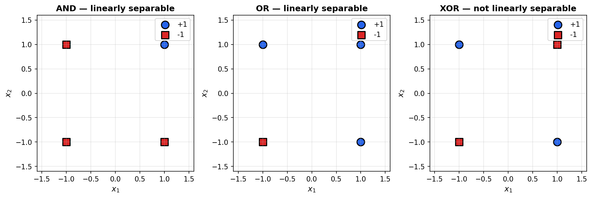
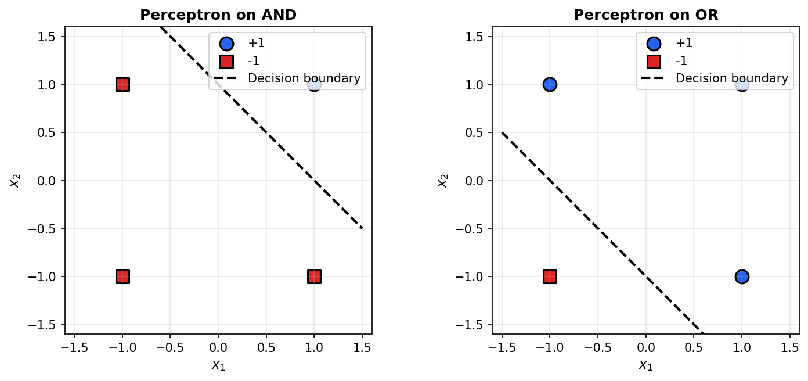
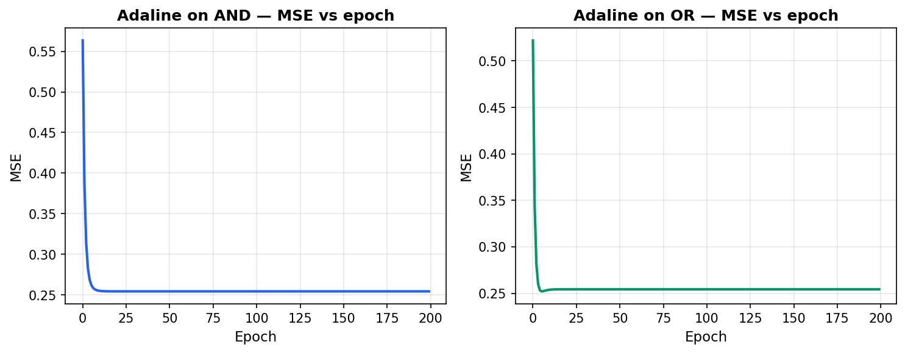
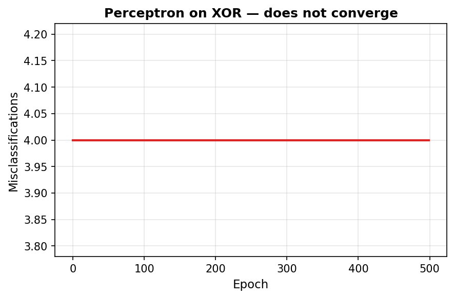
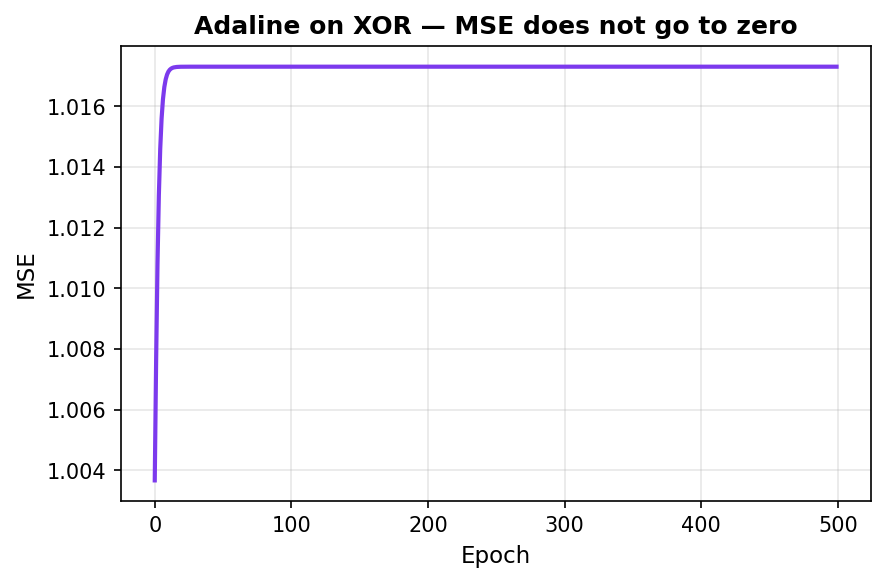
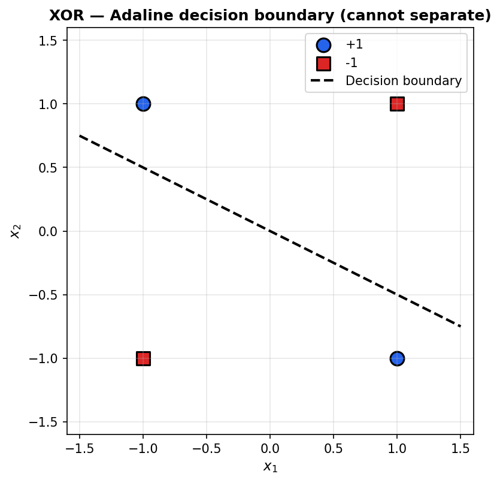
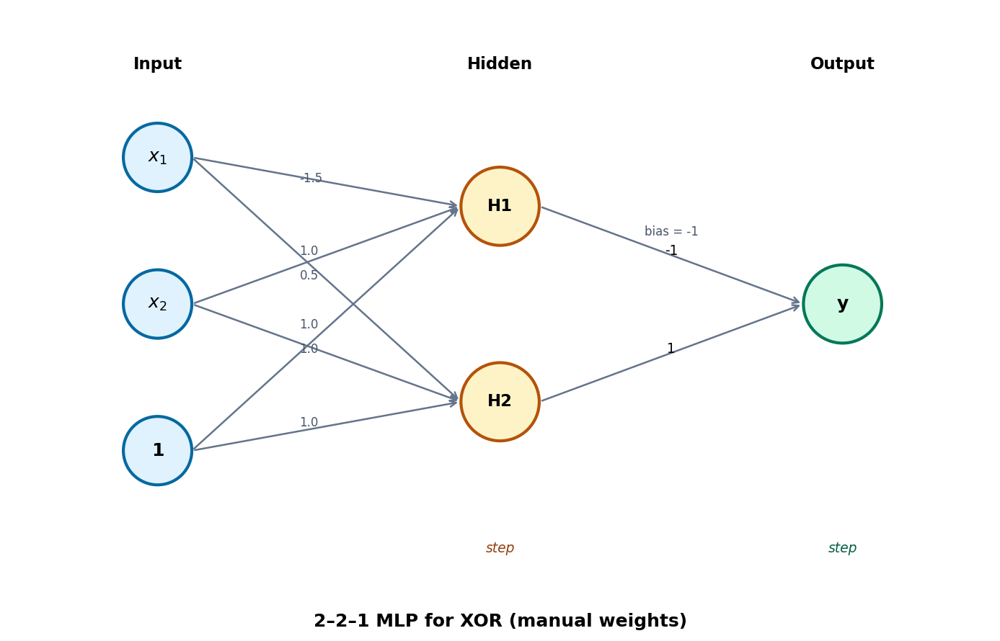

# Assignment 1: Perceptron vs Adaline and the XOR Problem

**Roll number:** [INSERT ROLL NUMBER ONLY – no name]  
**Course:** Artificial Neural Networks (ANN) — BSAI F23 Red  
**Due date:** 21-02-2026

---

All numerical results and plots in this report were obtained by **running the submitted notebook *Assignment_1.ipynb*** (Execute All). The figures below are exported from that run and illustrate linear separability, convergence behaviour, XOR failure, and the proposed multi-layer solution.

---

## 1. Linear separability and exploratory data analysis

Datasets for the AND, OR, and XOR logic functions were created in **bipolar format**: inputs and targets use only the values **−1** and **+1** (no 0/1). This choice matches the classical Perceptron/Adaline formulation and keeps the decision boundary at zero.

**Figure 1** shows scatter plots of the inputs (x₁, x₂) with points coloured by target class (+1 or −1). For **AND** and **OR**, the two classes can be separated by a single straight line: these problems are **linearly separable**. For **XOR**, the positive class lies at (1,−1) and (−1,1) and the negative class at (1,1) and (−1,−1), forming a checkerboard pattern. **No single line** can separate the two classes, so XOR is **not linearly separable**. This geometric fact is the reason single-layer networks (Perceptron and Adaline) cannot solve XOR.

**Figure 1.** AND and OR are linearly separable; XOR is not. (Bipolar format: −1 and +1.)

---

## 2. Perceptron vs Adaline: learning rules and convergence

### 2.1 Perceptron

The **Perceptron** uses **error-driven** updates: weights change only when the current output disagrees with the target. The update rule is **Δwᵢ = α · xᵢ · t**, where *t* is the target (not the error). The activation is a **binary step**: output +1 if net input ≥ 0, else −1.

When the notebook is run, the Perceptron **converges on AND in 3 epochs** and **on OR in 3 epochs**, reaching zero misclassifications. **Figure 2** shows the learned decision boundaries: a single line correctly separates the two classes in each case.

**Figure 2.** Perceptron decision boundaries after training on AND and OR (bipolar data).

### 2.2 Adaline

**Adaline** (Adaptive Linear Neuron) uses the **delta rule** (Widrow–Hoff): **Δwᵢ = α · (t − y_in) · xᵢ**, where **y_in** is the net input (before any activation). During training the neuron output is **linear** (y_in); for final classification a **threshold** is applied (e.g. class +1 if y_in ≥ 0, else −1). Mean Squared Error (MSE) is computed each epoch.

On AND and OR, Adaline’s MSE decreases over training and the learned linear boundary matches the separable solution. **Figure 3** shows MSE versus epoch for both tasks; the notebook contains the corresponding decision-boundary plots.

**Figure 3.** Adaline: MSE vs epoch for AND and OR. Convergence behaviour is visible in the notebook run.

---

## 3. The XOR problem: why both models fail

### 3.1 Attempting to train on XOR

When the same Perceptron and Adaline models are trained on the **XOR** dataset, both fail to achieve zero error.

**Perceptron on XOR:** The number of misclassifications **does not converge to zero**; it remains constant (e.g. 4 misclassifications every epoch). **Figure 4** illustrates that training does not converge.

**Figure 4.** Perceptron on XOR — misclassifications per epoch (no convergence).

**Adaline on XOR:** The MSE **does not converge to a near-zero error**. **Figure 5** shows MSE versus epoch; the final MSE remains around **1.02**. **Figure 6** shows the XOR data and the final decision boundary line learned by Adaline; the line cannot separate the two classes.

**Figure 5.** Adaline on XOR — MSE vs epoch (does not converge to zero).

**Figure 6.** XOR data and the Adaline decision boundary. No single line can separate the two classes.

### 3.2 Mathematical explanation: inequality contradiction

Suppose a single line could separate XOR: **w₀ + w₁x₁ + w₂x₂ ≥ 0** for class +1 and **< 0** for class −1. For the four XOR points we would need:

| Point   | Target | Inequality              |
|---------|--------|--------------------------|
| (1, 1)  | −1     | w₀ + w₁ + w₂ < 0         |
| (1, −1) | +1     | w₀ + w₁ − w₂ ≥ 0         |
| (−1, 1) | +1     | w₀ − w₁ + w₂ ≥ 0         |
| (−1, −1)| −1     | w₀ − w₁ − w₂ < 0         |

Adding the two “+1” inequalities gives **2w₀ ≥ 0**. Adding the two “−1” inequalities gives **2w₀ < 0**. So we require w₀ ≥ 0 and w₀ < 0 at the same time, which is **impossible**. Hence **no single line** can implement XOR.

### 3.3 Adaline: equation of the final decision boundary

From the notebook run, the Adaline weights converge to a line of the form w₀ + w₁x₁ + w₂x₂ = 0. The **equation of the final decision boundary** is:

**0.0588·x₁ + 0.1176·x₂ = 0**  (equivalently **x₁ + 2x₂ = 0**).

Whatever single line Adaline finds, the four XOR points form a checkerboard. Any such line will have at least one +1 and one −1 on the same side, so it **cannot separate** the classes. Adaline simply minimizes MSE subject to using one line; it cannot achieve zero error.

---

## 4. Multi-layer solution for XOR

A **multi-layer network** with one **hidden layer** can represent XOR by combining simpler functions (AND and OR) and then thresholding. The proposed solution is a **2–2–1** architecture: 2 inputs plus bias, 2 hidden neurons, 1 output neuron, with **step** activation throughout. Weights are **set by hand** (no learning).

### 4.1 Network architecture

**Figure 7** shows the architecture. The input layer has two inputs (x₁, x₂) and a bias (1). The hidden layer has two neurons (H1, H2), each with step activation. The output layer has one neuron with step activation.

**Figure 7.** Two–two–one (2–2–1) multi-layer network for XOR. Weights are set manually; all neurons use step activation.

### 4.2 Role of hidden neurons and weight values

- **H1** implements **AND**: it outputs +1 only when (x₁, x₂) = (1, 1). Weights from input to H1: **[bias, x₁, x₂] = [−1.5, 1, 1]**.
- **H2** implements **OR**: it outputs +1 when at least one input is +1, i.e. for (1,1), (1,−1), and (−1,1). Weights: **[0.5, 1, 1]**.

The **output neuron** should output +1 only when the input is (1,−1) or (−1,1), which corresponds to H1 = −1 and H2 = +1. So the output is **step(−1 − H1 + H2)**. Weights from hidden to output: **[bias, H1, H2] = [−1, −1, 1]**.

With these weights, the network computes XOR correctly for all four bipolar inputs.

### 4.3 Why hidden layers and non-linear activation are necessary

A **single linear boundary** (one line) cannot separate XOR, as shown by the inequality argument above. **Hidden units with non-linear (e.g. step) activation** build **intermediate features** (here, AND and OR). The output neuron then combines these in a **non-linear** way. Without a hidden layer and non-linear activations, the entire network would be equivalent to one linear classifier and would fail on XOR. This is why the XOR problem historically motivated the move to multi-layer perceptrons (MLPs).

---

## References

[1] F. Rosenblatt, “The perceptron: A probabilistic model for information storage and organization in the brain,” *Psychological Review*, vol. 65, no. 6, pp. 386–408, 1958.  
[2] B. Widrow and M. E. Hoff, “Adaptive switching circuits,” in *1960 IRE WESCON Convention Record*, pp. 96–104, 1960.  
[3] M. Minsky and S. Papert, *Perceptrons: An Introduction to Computational Geometry*. Cambridge, MA: MIT Press, 1969.
