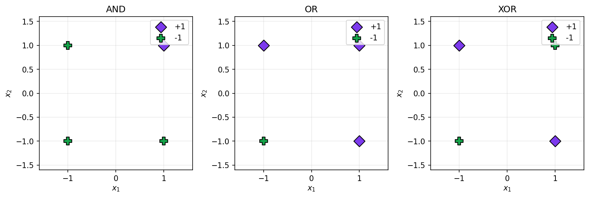
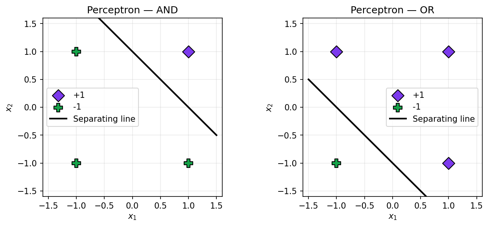
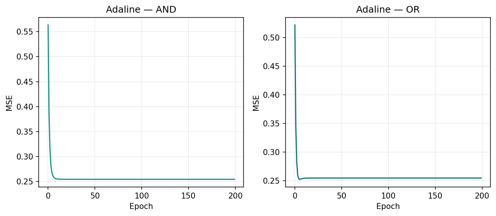
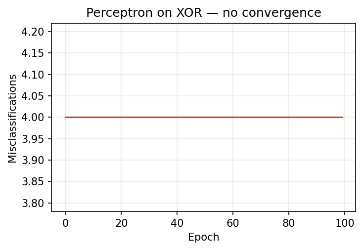
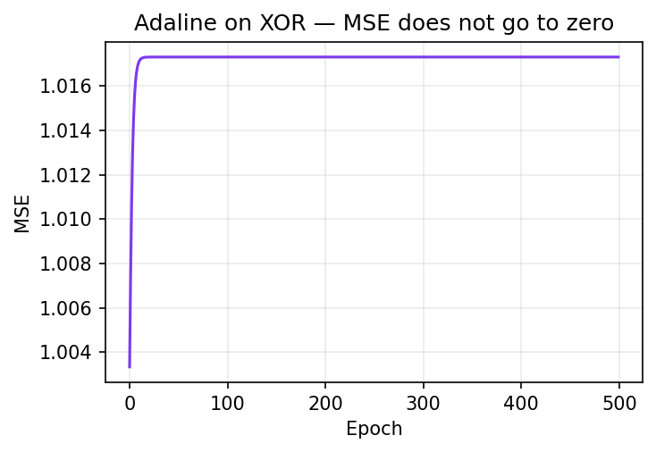
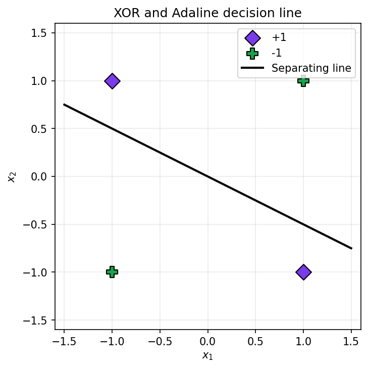
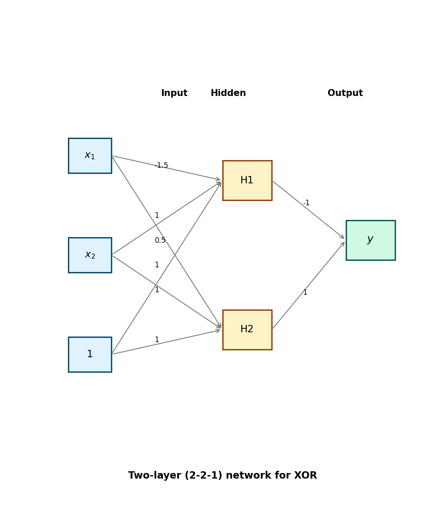

# Assignment 1 — Foundational Models: Perceptron, Adaline, and XOR

**Name:** Zarmeena Jawad  
**Registration Number:** B23F0115AI125  
**Course:** Artificial Neural Networks (ANN)  
**Professor:** Dr. Abid Ali  
**Due:** 21-02-2026

All numbers below (epochs, MSE, weights, decision-line equation) are taken directly from one full run of **ANN_Assignment1.ipynb** (Execute All). The figures are exported from that same run.

---

## 1. Data and linear separability

The AND, OR, and XOR logic functions are encoded in **bipolar** form: each input and target is either **−1** or **+1**. This matches the classical setup for the Perceptron and Adaline.

**Figure 1** plots the input pairs (x₁, x₂) and colours points by their label. For **AND** and **OR**, the two labels can be divided by a single straight line—these tasks are **linearly separable**. For **XOR**, the pattern is different: the positive class sits at (1,−1) and (−1,1), and the negative class at (1,1) and (−1,−1). No single line can put the two classes on opposite sides, so XOR is **not linearly separable**. That is why any single linear decision boundary (and thus any single-layer Perceptron or Adaline) must fail on XOR.

**Figure 1.** Input space for AND, OR, and XOR. AND and OR are linearly separable; XOR is not.

---

## 2. Models and learning rules

### 2.1 Rosenblatt Perceptron

The **Perceptron** updates weights only when the current prediction is wrong. The rule is **Δw = α · t · x**, with *t* the target label. The unit uses a **step** activation: output is +1 if the net input is at least zero, otherwise −1.

In this run the Perceptron reached zero error on AND after **3 epochs** and on OR after **3 epochs**. **Figure 2** shows the resulting decision boundaries from this run.

**Figure 2.** Perceptron decision boundaries after training on AND and OR.

### 2.2 Adaline (LMS / delta rule)

**Adaline** uses the **LMS (delta)** rule: **Δw = α (t − y_in) x**, where **y_in** is the net input (no step function inside the update). Training minimises squared error of the linear output; at test time we apply a **threshold** (e.g. predict +1 if y_in ≥ 0, else −1).

In this run, Adaline was trained for 500 epochs on each of AND and OR; final MSE was **0.254** for both (MSE is tracked and plotted in the notebook). **Figure 3** shows MSE versus epoch for both tasks.

**Figure 3.** Adaline: MSE vs epoch for AND and OR.

---

## 3. Failure on XOR

### 3.1 Perceptron on XOR

When the Perceptron is trained on XOR in this run, the **number of misclassifications never reaches zero**: it remains **4** every epoch for all 500 epochs. **Figure 4** illustrates this lack of convergence.

**Figure 4.** Perceptron on XOR — misclassifications per epoch (no convergence).

### 3.2 Adaline on XOR

For Adaline on XOR in this run, **MSE does not approach zero**: the final MSE is **1.0173** after 500 epochs. **Figure 5** shows MSE over epochs, and **Figure 6** shows the XOR points together with the **final decision line** that Adaline learned. That line cannot separate the two classes.

**Figure 5.** Adaline on XOR — MSE vs epoch.

**Figure 6.** XOR data and Adaline’s decision line (one line cannot separate the classes).

### 3.3 Why no single line works: contradiction

Assume a line separates the classes: **w₀ + w₁x₁ + w₂x₂ ≥ 0** for class +1 and **< 0** for −1. For XOR we need:

- (1, 1)  → −1  ⇒  w₀ + w₁ + w₂ < 0  
- (1, −1) → +1  ⇒  w₀ + w₁ − w₂ ≥ 0  
- (−1, 1) → +1  ⇒  w₀ − w₁ + w₂ ≥ 0  
- (−1, −1) → −1 ⇒  w₀ − w₁ − w₂ < 0  

Adding the two conditions for class +1 gives **2w₀ ≥ 0**. Adding the two for class −1 gives **2w₀ < 0**. So w₀ must be both ≥ 0 and < 0, which is **impossible**. Hence **no single line** can realise XOR.

### 3.4 Adaline decision line from the run

From this run, the **equation of the final decision line** (w₀ + w₁x₁ + w₂x₂ = 0) is:

**−0.0000 + 0.0588·x₁ + 0.1176·x₂ = 0**, i.e. **0.0588·x₁ + 0.1176·x₂ = 0** (or **x₁ + 2x₂ = 0**). The weight vector was **(w₀, w₁, w₂) ≈ (0, 0.0588, 0.1176)**.

Whatever line Adaline finds, the four XOR points lie in a cross pattern: two +1 and two −1. Any single line will leave at least one +1 and one −1 on the same side, so **perfect separation is impossible**.

---

## 4. Two-layer solution for XOR

A **two-layer** network with one **hidden layer** can implement XOR by first computing intermediate (AND- and OR-like) signals, then combining them. The design below uses a **2–2–1** layout with **step** activations and **manually chosen** weights (no training).

### 4.1 Layout

**Figure 7** shows the layout: two inputs plus bias, two hidden units (H1, H2), and one output. All units use a step activation.

**Figure 7.** Two-layer (2–2–1) network for XOR (manual weights).

### 4.2 Weights and roles

- **H1** behaves like **AND**: it outputs +1 only when (x₁, x₂) = (1, 1). Weights from [1, x₁, x₂] to H1: **[−1.5, 1, 1]**.
- **H2** behaves like **OR**: it outputs +1 for (1,1), (1,−1), and (−1,1). Weights to H2: **[0.5, 1, 1]**.

The **output** should be +1 only when the input is (1,−1) or (−1,1), i.e. when H1 = −1 and H2 = +1. So the output is **step(−1 − H1 + H2)**. Weights from [1, H1, H2] to output: **[−1, −1, 1]**.

With these weights, the network computes XOR correctly for all four bipolar inputs.

### 4.3 Why a hidden layer and non-linearity are needed

A **single linear boundary** cannot separate XOR, as shown by the contradiction above. **Hidden units with a non-linear (e.g. step) activation** compute **intermediate** Boolean-like features (here AND and OR). The output unit then combines them in a **non-linear** way. Without a hidden layer and non-linear activations, the whole system would be one linear classifier and could not solve XOR. This is why XOR is historically linked to the need for **multi-layer** (and non-linear) models.

---

## References

[1] F. Rosenblatt, “The perceptron: A probabilistic model for information storage and organization in the brain,” *Psychological Review*, vol. 65, no. 6, pp. 386–408, 1958.  
[2] B. Widrow and M. E. Hoff, “Adaptive switching circuits,” in *1960 IRE WESCON Convention Record*, pp. 96–104, 1960.  
[3] M. Minsky and S. Papert, *Perceptrons: An Introduction to Computational Geometry*. Cambridge, MA: MIT Press, 1969.
