# COMP-341 Assignment 02 Report

## Hebbian / Neo-Hebbian Learning and STDP

**Student Name:** Ali Hamza  
**Roll Number:** B23F0063AI106  
**Course:** Artificial Neural Network (COMP-341)  
**Instructor:** Dr. Abid Ali

**Submitted Files Referenced:**

- Notebook: `Assignment_B23F0063AI106.ipynb`
- Report: `Assignment_B23F0063AI106_report_proper.md`

---

## 1. Introduction

This report presents the implementation and analysis of the assignment tasks related to Hebbian learning, Oja's rule, principal component extraction, and Spike-Timing Dependent Plasticity (STDP). The work is organized exactly by assignment tasks and evaluated with emphasis on:

- conceptual correctness,
- code-to-theory consistency,
- plot quality and interpretation,
- mathematically consistent notation.

The report includes only essential code logic and focuses primarily on method, outputs, and interpretation.

---

## 2. Q1: Oja's Rule and Unsupervised PCA (20 Marks)

### 2.1 Task 2.1 - Basic Hebbian Rule (Unstable) [5 Marks]

### 2.1.1 Task Objective

Implement the classical Hebbian update on correlated 2D data and demonstrate instability of the weight dynamics.

### 2.1.2 Core Method

Basic Hebbian update used:

\[
\Delta w = \eta yx, \quad y = w^T x
\]

Minimal implementation idea:

```python
for x in X:
    y = np.dot(w, x)
    w += eta * y * x
```

### 2.1.3 Data and Observed Outputs

```text
Dataset shape: (200, 2)
Empirical covariance matrix:
[[2.95632304 2.3439734 ]
 [2.3439734  1.92483448]]

Basic Hebbian final alignment: angle=nan deg, |cosine|=nan
Final ||w||: nan
```

### 2.1.4 Visual Results

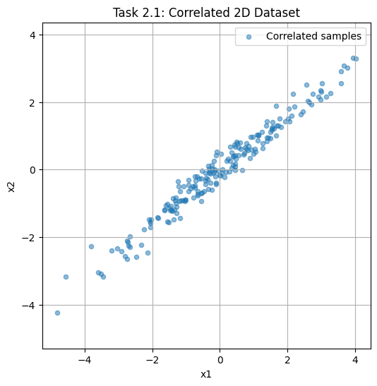

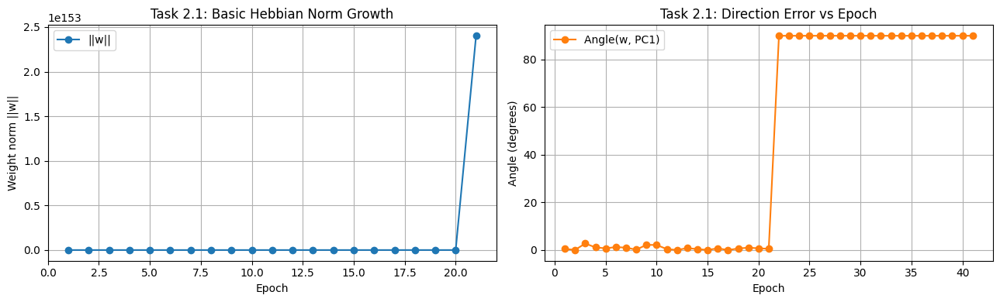

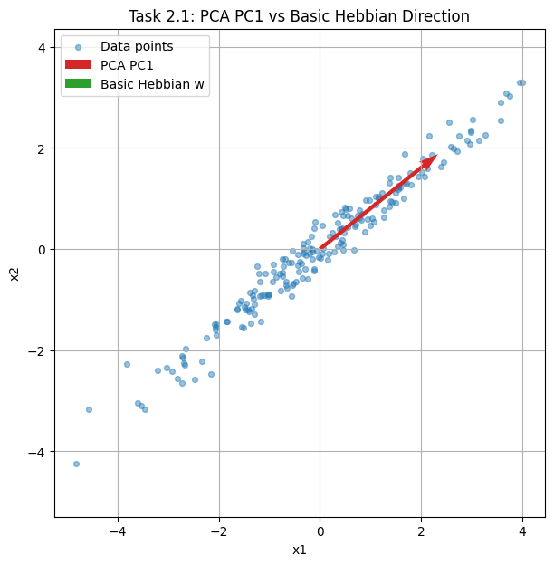

### 2.1.5 Interpretation

The run diverged numerically (`nan`), which is consistent with the expected instability of unconstrained Hebbian growth on correlated inputs. Since there is no normalization/competition term, weight norm can blow up, and direction comparison with true PC becomes invalid. This directly supports the assignment requirement to show unstable behavior and lack of reliable principal-component convergence.

---

### 2.2 Task 2.2 - Oja's Rule (Stable PCA) [10 Marks]

### 2.2.1 Task Objective

Implement Oja's rule and verify convergence toward the first principal component obtained from sklearn PCA.

### 2.2.2 Core Method

Oja update used:

\[
\Delta w = \eta y(x - yw)
\]

Equivalent decomposition:

\[
\Delta w = \eta(yx) - \eta(y^2w)
\]

The second term acts as normalization/stabilization.

Minimal implementation idea:

```python
for x in X:
    y = np.dot(w, x)
    w += eta * y * (x - y * w)
```

### 2.2.3 Observed Outputs

```text
Oja final alignment: angle=0.4779 deg, |cosine|=0.999965
Final ||w|| before final unit-normalization (last epoch): 1.0001874864718119

Comparison Summary
------------------
Basic Hebbian: final ||w|| = nan, final angle to PC1 = nan deg
Oja's Rule    : final ||w|| ~ 1.000000 (unit), final angle to PC1 = 0.4779 deg
```

### 2.2.4 Visual Results

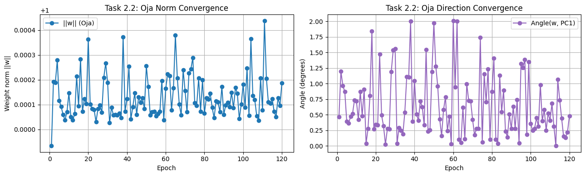

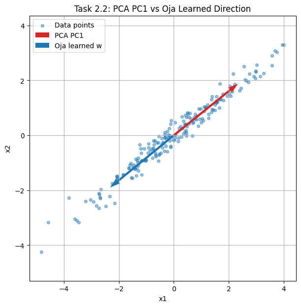

### 2.2.5 Interpretation

The very small angle to PCA PC1 (0.4779°) and unit-scale norm confirm stable convergence to the dominant principal direction. This result validates Oja's rule as a stable unsupervised PCA-like learner.

### 2.2.6 Why Oja is Neo-Hebbian

Oja's rule preserves the Hebbian correlation term but augments it with a local stabilizing term proportional to \(y^2w\). Therefore, it is a modified Hebbian rule (Neo-Hebbian), not purely classical Hebbian.

---

### 2.3 Task 2.3 - Receptive Fields from Natural Image Patches [5 Marks]

### 2.3.1 Task Objective

Learn first 10 principal directions from 10,000 random 8×8 patches and analyze visual structure of learned weights.

### 2.3.2 Core Method

- Source patches from `olivetti_faces`.
- Flatten each 8×8 patch to a 64D vector.
- Mean-center/standardize.
- Learn components sequentially with Oja + deflation.

Essential multi-component logic:

```python
for i in range(n_components):
    w = ojas_rule(residual_X)
    components.append(w)
    residual_X = residual_X - np.outer(residual_X @ w, w)
```

### 2.3.3 Observed Outputs

```text
Patch source: olivetti_faces
Patch matrix shape: (10000, 64)
Learned components shape: (10, 64)

Mean similarity over 10 components: 0.888234999486834
```

### 2.3.4 Visual Results

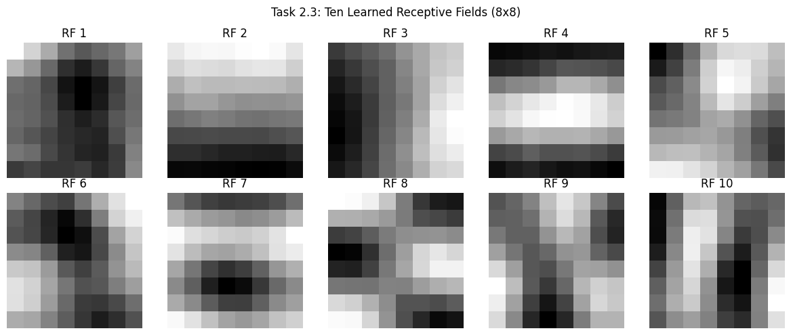

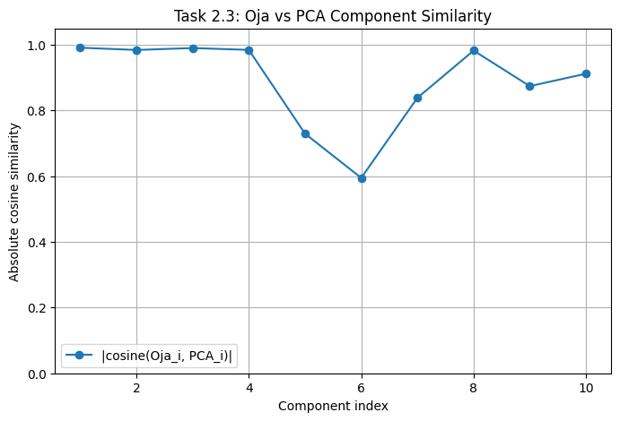

### 2.3.5 Interpretation

The learned components show oriented and contrast-sensitive structures typical of natural-image statistics. Quantitatively, the high mean cosine similarity (0.8882) between Oja-learned and PCA components supports the expected Hebbian->Oja->PCA linkage. Qualitatively, several filters are edge-like and resemble Gabor-like receptive-field behavior often discussed for V1.

---

## 3. Q3: Differential Hebbian Learning and Neo-Hebbian Extensions (20 Marks)

### 3.1 Part A - Theory [8 Marks]

### 3.1.1 Q3(a) Differential Hebbian Learning

Standard Hebbian rule:

\[
\frac{dw}{dt} = \eta x(t)y(t)
\]

Differential Hebbian rule:

\[
\frac{dw}{dt} = \eta \frac{dx}{dt}\frac{dy}{dt}
\]

Difference: standard Hebbian uses instantaneous co-activation; differential Hebbian emphasizes temporal co-variation (changes), so it is better aligned with predictive timing relationships.

### 3.1.2 Q3(b) STDP and Temporal Window

Define timing difference \(\Delta t = t*{post} - t*{pre}\). A standard pair-based model is:

\[
\Delta w =
\begin{cases}
A*+ e^{-\lvert\Delta t\rvert/\tau*+}, & \Delta t > 0 \quad (\text{LTP})\\
-A*- e^{-\lvert\Delta t\rvert/\tau*-}, & \Delta t < 0 \quad (\text{LTD})
\end{cases}
\]

So if pre-synaptic firing precedes post-synaptic firing, potentiation occurs; for reverse order, depression occurs.

### 3.1.3 Q3(c) Mexican-Hat Correlation and Orientation Selectivity

A Mexican-hat correlation profile (local excitation, surround inhibition) encourages structured positive and negative receptive subregions under Hebbian-like adaptation. This supports emergence of orientation-selective filters in Linsker-style self-organization models.

---

### 3.2 Part B - Python STDP Simulation [12 Marks]

### 3.2.1 Task Objective

Simulate STDP using required parameters and compare random, causal, and anti-causal timing conditions.

### 3.2.2 Parameters Used

- \(A\_+ = 0.01\)
- \(A\_- = 0.012\)
- \(\tau\_+ = 20\,ms\)
- \(\tau\_- = 20\,ms\)
- \(T = 1000\,ms\)
- epochs = 50

### 3.2.3 Essential Window Logic

```python
if dt > 0:
    dw = A_plus * exp(-abs(dt)/tau_plus)
elif dt < 0:
    dw = -A_minus * exp(-abs(dt)/tau_minus)
```

### 3.2.4 Observed Outputs

```text
Random case final weight: 0.9994316929072757
Random case pre spikes: 10 post spikes: 11

Causal final weight     : 1.0
Anti-causal final weight: 0.0

Expected trend check: causal > anti-causal (usually true under standard STDP parameters).
```

### 3.2.5 Visual Results

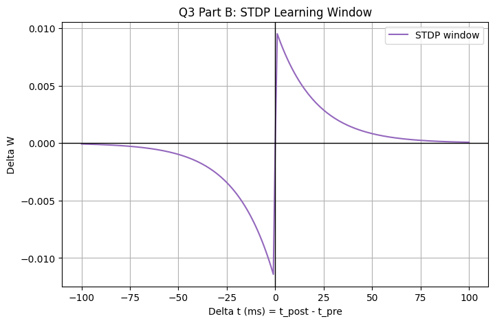

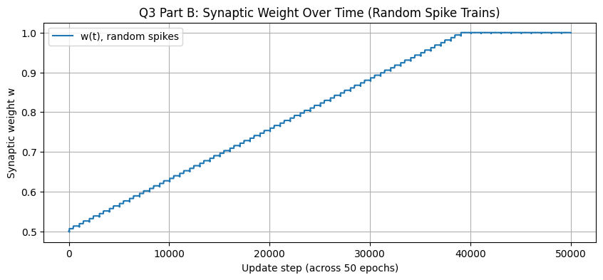

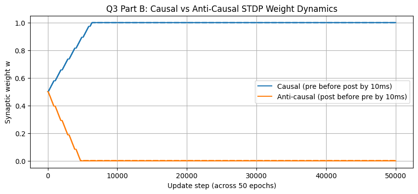

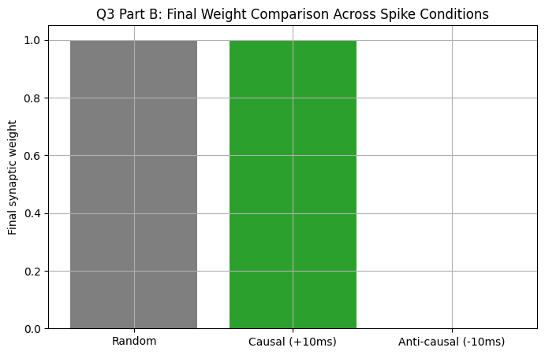

### 3.2.6 Interpretation

The simulation outcome is consistent with STDP theory:

- causal ordering (pre before post) increases weight,
- anti-causal ordering decreases weight.

This directly demonstrates temporal Hebbian plasticity and its connection to differential Hebbian learning principles.

---

## 4. Consolidated Result Summary

| Section | Key Quantitative Result | Conclusion |
| --- | --- | --- |
| Q1 Task 2.1 | Hebbian `norm(w)` and angle became `nan` | Unstable / diverging dynamics |
| Q1 Task 2.2 | Oja vs PC1 angle = **0.4779°** | Accurate PCA-direction recovery |
| Q1 Task 2.3 | Mean Oja-PCA similarity = **0.8882** | Strong alignment with PCA components |
| Q3 Part B | Causal final \(w=1.0\), Anti-causal final \(w=0.0\) | Correct LTP/LTD timing behavior |
