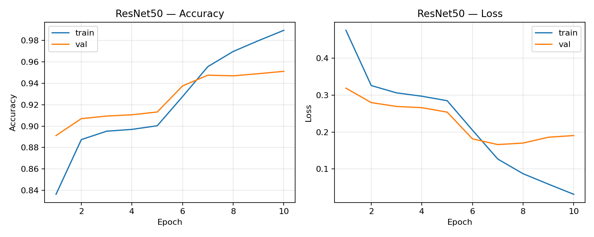
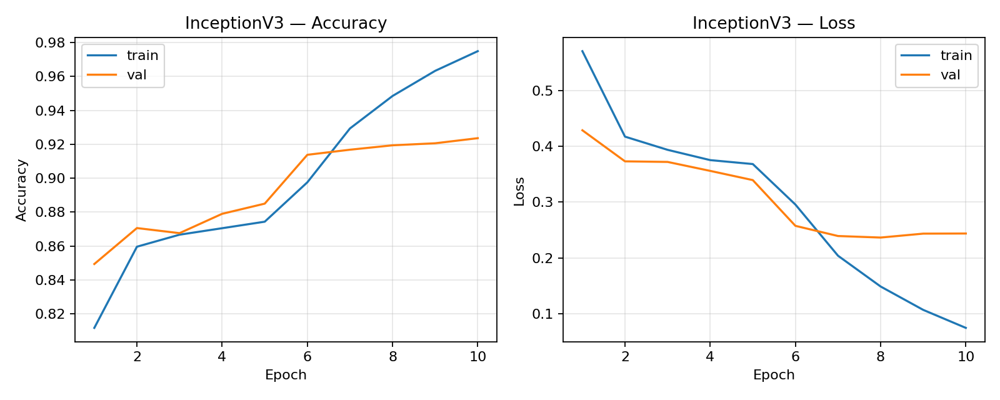
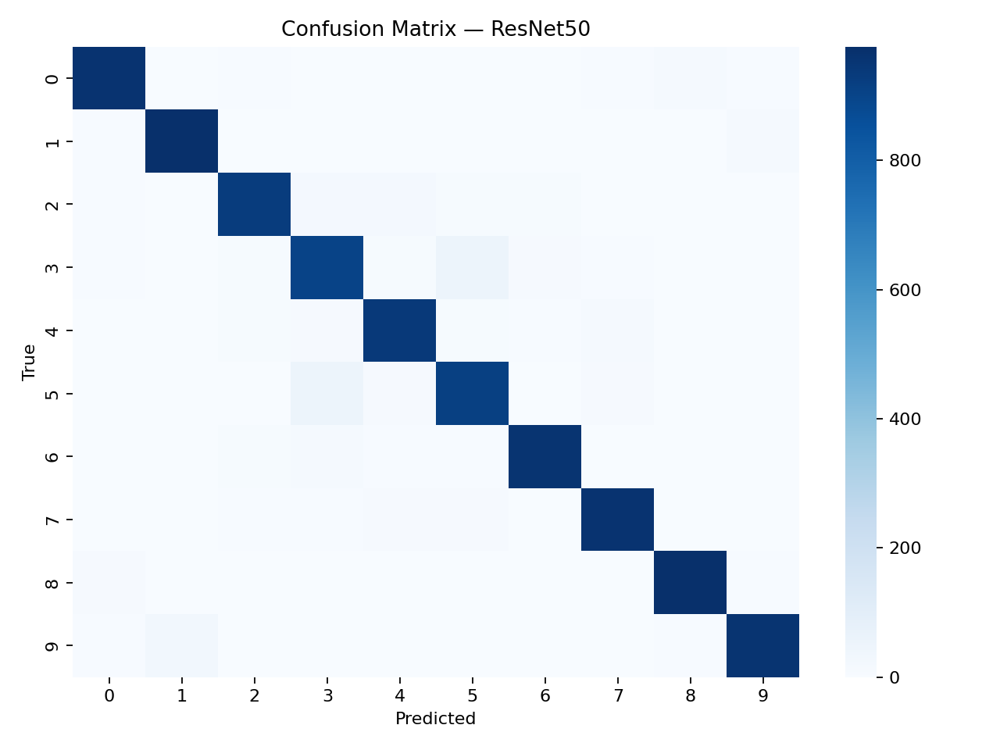
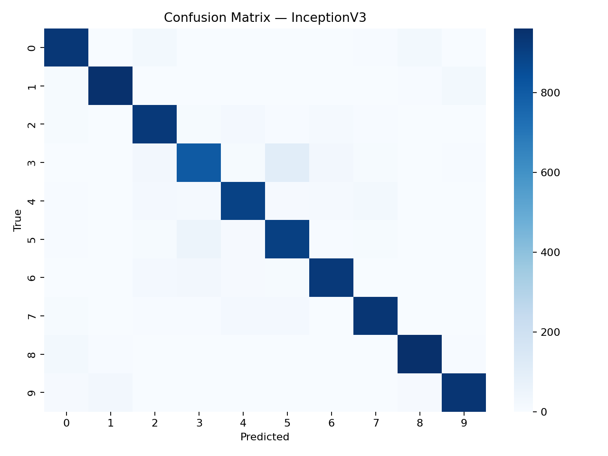

# COMP-443 — Deep Learning (Assignment 3)
## Transfer Learning for CIFAR-10: ResNet50 vs InceptionV3

**Members:** Abdul Basit, Dawood Arsalan, Zainab Sajjad  
**Task:** Implement and compare ResNet50 and InceptionV3 using transfer learning on CIFAR-10.

---

## Abstract
This report presents a comparative evaluation of two ImageNet-pretrained convolutional neural network backbones—**ResNet50** and **InceptionV3**—adapted to the **CIFAR-10** image classification task via transfer learning. Both models are trained in two stages (frozen-backbone head training followed by partial fine-tuning) and are evaluated on the CIFAR-10 test set. The experimental results show that ResNet50 achieves higher test accuracy and lower test loss than InceptionV3 under the same training schedule, at a slightly lower training time in this run.

## 1. Objective
To implement and compare **ResNet50** and **InceptionV3** for CIFAR-10 classification using transfer learning, and to analyze performance differences using learning curves and confusion matrices.

## 2. Dataset
**CIFAR-10** contains 60,000 RGB images (32×32) across 10 classes (50,000 training and 10,000 test).

**Classes (index → label):**  
0→airplane, 1→automobile, 2→bird, 3→cat, 4→deer, 5→dog, 6→frog, 7→horse, 8→ship, 9→truck

**Splits and preprocessing**
- Train/validation split: 90%/10% (from the training portion).
- Input resizing: CIFAR-10 images are resized to the model’s input size (ResNet50: 224×224; InceptionV3: 299×299).
- Normalization: model-specific `preprocess_input`.
- Augmentation (applied during training): random horizontal flip, brightness and contrast perturbations.

## 3. Methodology
### 3.1 Transfer learning setup
For both models:
- Backbone initialized with ImageNet weights and used with `include_top=False`.
- Global average pooling applied to produce a compact feature vector.
- A new 10-way softmax classification head is trained for CIFAR-10.

### 3.2 Two-stage training procedure
- **Stage 1 (Head training):** the backbone is frozen and only the classification head is trained.
- **Stage 2 (Fine-tuning):** the last backbone layers are unfrozen and fine-tuned using a smaller learning rate; BatchNorm layers are kept frozen to preserve stable statistics.

### 3.3 Training configuration
- Optimizer: Adam  
- Loss: categorical cross-entropy  
- Metric: accuracy  
- Epochs: 5 (head) + 5 (fine-tune) for each model

## 4. Results
All outputs are saved by the notebook:
- Curves: `../figures/*_accuracy_loss.png`
- Confusion matrices: `../figures/confusion_matrix_*.png` and `../results/confusion_matrix_*.npy`
- Summary table: `../results/summary_table.csv` and `../results/metrics.json`

### 4.1 Quantitative comparison (test set)
| Model | Input Size | Test Accuracy | Test Loss | Train Time (s) | Params (M) | Saved Model (MB) |
|---|---:|---:|---:|---:|---:|---:|
| ResNet50 | 224 | **0.9475** | **0.1862** | **368.94** | 23.61 | 228.49 |
| InceptionV3 | 299 | 0.9186 | 0.2639 | 407.83 | 21.82 | 181.03 |

### 4.2 Learning curves (accuracy and loss)
<figure>
  
  <figcaption><b>Figure 1.</b> ResNet50 learning curves across head training and fine-tuning stages.</figcaption>
</figure>

<figure>
  
  <figcaption><b>Figure 2.</b> InceptionV3 learning curves across head training and fine-tuning stages.</figcaption>
</figure>

### 4.3 Confusion matrices
<figure>
  
  <figcaption><b>Figure 3.</b> ResNet50 confusion matrix on CIFAR-10 test set (10,000 images).</figcaption>
</figure>

<figure>
  
  <figcaption><b>Figure 4.</b> InceptionV3 confusion matrix on CIFAR-10 test set (10,000 images).</figcaption>
</figure>

## 5. Discussion
### 5.1 Accuracy and loss
ResNet50 achieves the best overall performance in this experiment (**94.75%** test accuracy) compared to InceptionV3 (**91.86%**). The lower test loss for ResNet50 indicates not only higher correctness but also higher confidence on correct predictions on average.

### 5.2 Training time and input resolution
InceptionV3 uses a larger input resolution (299×299) than ResNet50 (224×224), which increases per-step compute and memory cost. Consistent with this, InceptionV3 required more training time in this run (407.83s vs 368.94s) despite having fewer parameters (21.82M vs 23.61M). This highlights that parameter count alone is not a complete proxy for runtime; input resolution and architecture operations also affect wall-clock time.

### 5.3 Error patterns from confusion matrices
Both models show higher confusion between semantically similar classes. The most frequent confusions observed include **cat ↔ dog** and **truck → automobile**, which is expected for CIFAR-10 due to limited resolution and similar visual appearance. InceptionV3 shows notably higher **cat → dog** confusion compared to ResNet50, aligning with its lower overall test accuracy.

### 5.4 Why ResNet may generalize better here
ResNet’s residual connections encourage stable gradient flow in deep networks and allow the model to learn refinements over identity mappings. For transfer learning, this can yield strong feature reuse and smooth adaptation with limited fine-tuning. In contrast, Inception’s multi-branch feature extraction can be beneficial, but the larger input size and architecture complexity may require more careful tuning (learning rates, augmentation strength, or longer fine-tuning) to match ResNet’s performance under the same short schedule.

## 6. Conclusion
Under a matched two-stage transfer learning setup on CIFAR-10, **ResNet50 outperformed InceptionV3** in both accuracy and loss while also training faster in this run. Future work can include longer fine-tuning schedules, per-class precision/recall reporting, and systematic hyperparameter sweeps (learning rate, augmentation strength, and number of unfrozen layers) to further optimize both architectures.

## References
1. K. He, X. Zhang, S. Ren, and J. Sun, “Deep Residual Learning for Image Recognition,” *CVPR*, 2016.  
2. C. Szegedy et al., “Rethinking the Inception Architecture for Computer Vision,” *CVPR*, 2016.  
3. A. Krizhevsky, “Learning Multiple Layers of Features from Tiny Images,” 2009 (CIFAR-10).  
