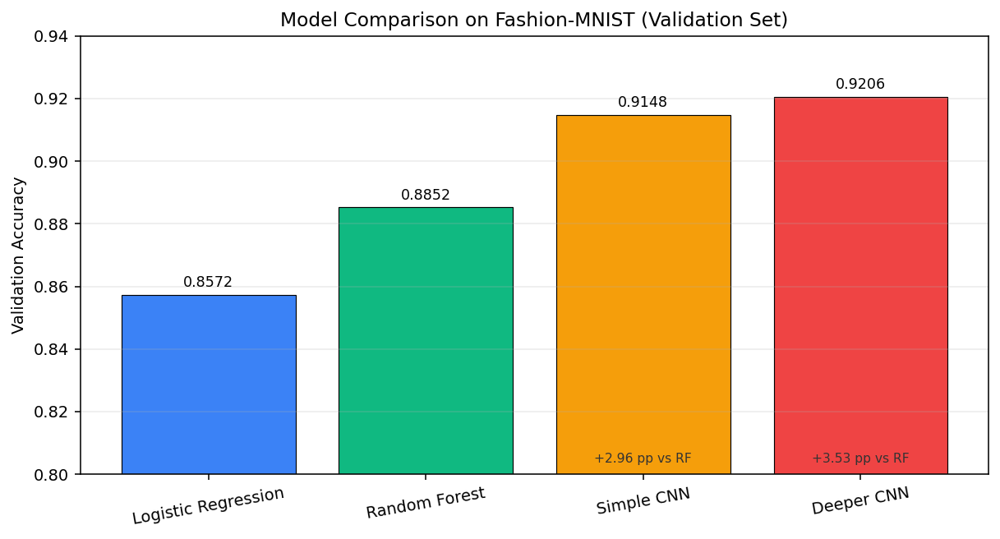
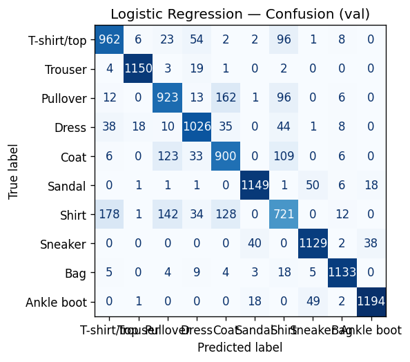
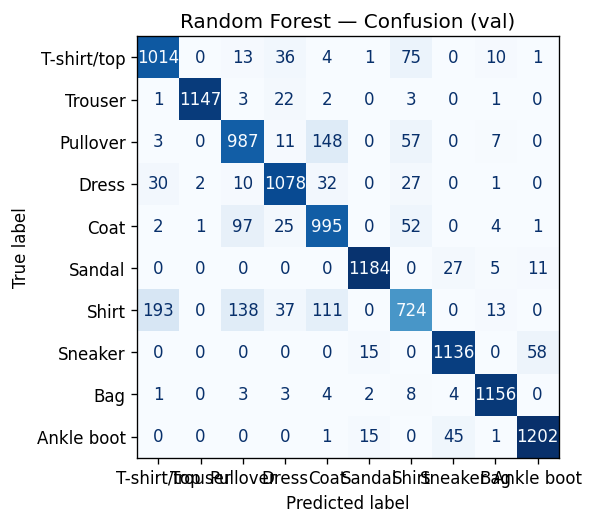
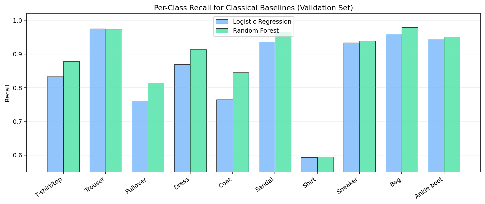
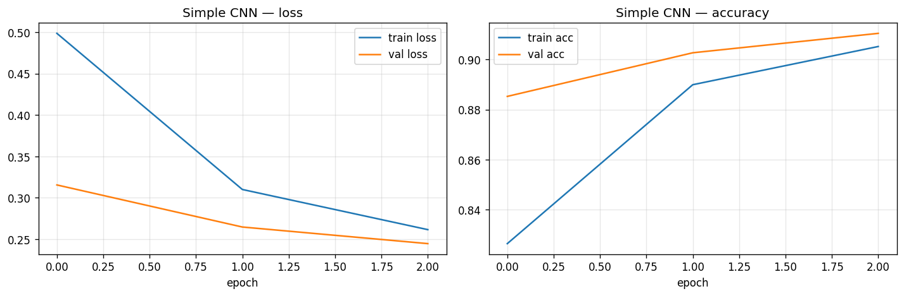
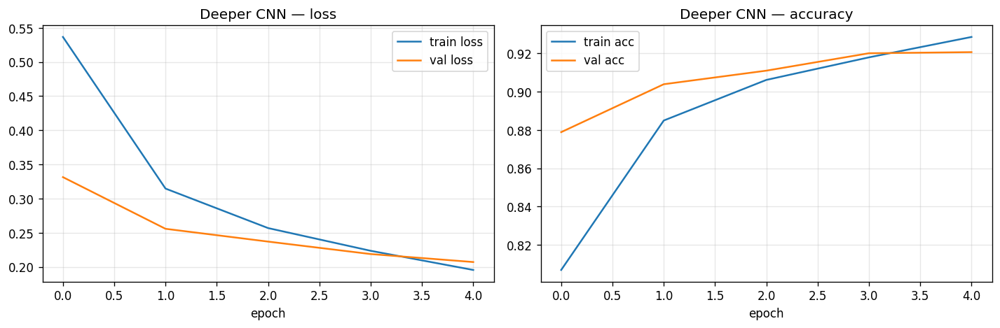

<div align="center">

# COMP-443 - Deep Learning
## Assignment 01 Report
### Classical vs Deep Models on Fashion-MNIST

**Students:**  
Ali Hamza (Registration No.: B23F0063AI106)  
Zarmeena Jawad (Registration No.: B23F0115AI125)  
**Course:** Deep Learning (COMP-443)  
**Instructor:** Dr. Arshad Iqbal  
**Submission Date:** 16 February 2026

</div>

---

## Abstract
This report compares two classical machine-learning models (Logistic Regression and Random Forest) and two convolutional neural networks (Simple CNN and Deeper CNN) on the Fashion-MNIST image-classification benchmark. All models are trained using the same preprocessing pipeline and evaluated on the same 12,000-sample validation split to ensure a fair comparison. The best model is the **Deeper CNN** with **92.06% validation accuracy** and **0.2071 validation loss**, outperforming the best classical baseline (Random Forest, 88.53%) by **3.53 percentage points**. The results show a clear and consistent advantage for CNNs because they preserve spatial structure instead of using flattened pixels only. Error analysis further shows that visually similar upper-body classes (especially **Shirt**, **T-shirt/top**, **Pullover**, and **Coat**) remain the dominant source of mistakes for classical models.

---

## 1. Problem Statement and Assignment Requirements
The assignment requires:
- One publicly available dataset
- Four algorithms total
- Two classical (conventional) models
- Two deep learning models
- Training, evaluation, and comparison in a formal report

This submission uses **Fashion-MNIST** and implements:
- Logistic Regression (classical baseline)
- Random Forest (classical non-linear baseline)
- Simple CNN (deep learning baseline)
- Deeper CNN (higher-capacity deep model)

---

## 2. Dataset and Preprocessing

### 2.1 Dataset Overview
Fashion-MNIST is a grayscale image dataset of clothing items with:
- **60,000** training images
- **10,000** test images (official test set)
- Image size: **28 x 28**
- Classes: **10**

Class labels:
1. T-shirt/top
2. Trouser
3. Pullover
4. Dress
5. Coat
6. Sandal
7. Shirt
8. Sneaker
9. Bag
10. Ankle boot

### 2.2 Preprocessing Pipeline (`src/data.py`)
The same preprocessing pipeline is applied before training all models:
- Load dataset using `tf.keras.datasets.fashion_mnist`
- Normalize pixel values from `[0, 255]` to `[0, 1]` (`float32`)
- Create a reproducible train/validation split using a fixed seed (`42`)
- Split sizes:
    - Training: **48,000**
    - Validation: **12,000**
    - Test: **10,000** (held out, not used for model selection in this report)
- Add channel dimension `(28, 28, 1)` for CNN inputs
- Flatten images to `784` features for classical models

### 2.3 Fair-Comparison Design
To make model comparison meaningful:
- The **same validation split** is used for all models
- Deep models and classical models are compared on the **same target labels**
- Only architecture/model family changes across experiments

---

## 3. Methodology (Step-by-Step)
1. Select Fashion-MNIST as a balanced benchmark for multi-class image classification.
2. Apply a shared preprocessing pipeline for both classical and deep models.
3. Train two classical models on flattened vectors (784 features).
4. Train two CNNs on image tensors `(28, 28, 1)`.
5. Evaluate all models on the validation split.
6. Save confusion matrices (classical models) and learning curves (CNNs).
7. Compare performance quantitatively and analyze dominant error patterns.

---

## 4. Model Selection and Rationale

### 4.1 Logistic Regression
- Strong linear baseline for multi-class classification
- Fast to train and easy to interpret
- Useful for measuring the benefit of more expressive models

### 4.2 Random Forest
- Non-linear ensemble baseline
- Can capture feature interactions ignored by linear models
- Often improves over Logistic Regression on tabularized image features

### 4.3 Simple CNN
- First deep learning baseline with convolution + pooling
- Learns local spatial features (edges, textures, shapes)
- Lower complexity than deeper CNN, useful for capacity comparison

### 4.4 Deeper CNN
- Adds a second convolution block and a larger dense layer
- Tests whether additional capacity improves generalization on Fashion-MNIST

---

## 5. Model Specifications and Capacity Estimates

### 5.1 Classical Models

**Logistic Regression**
- `LogisticRegression`
- `penalty='l2'`
- `C=1.0`
- `solver='lbfgs'`
- `multi_class='multinomial'`
- `max_iter=200`
- `n_jobs=-1`
- Input: flattened `784`-dimensional vector

**Random Forest**
- `RandomForestClassifier`
- `n_estimators=150`
- `max_depth=None`
- `random_state=42`
- `n_jobs=-1`
- Input: flattened `784`-dimensional vector

### 5.2 Deep Models (CNNs)

**Simple CNN**
- Conv2D(32, 3x3, ReLU, same)
- Conv2D(32, 3x3, ReLU, same)
- MaxPooling2D(2x2)
- Flatten
- Dense(128, ReLU)
- Dropout(0.3)
- Dense(10, Softmax)

**Deeper CNN**
- Conv2D(32, 3x3, ReLU, same)
- Conv2D(32, 3x3, ReLU, same)
- MaxPooling2D(2x2)
- Conv2D(64, 3x3, ReLU, same)
- Conv2D(64, 3x3, ReLU, same)
- MaxPooling2D(2x2)
- Flatten
- Dense(256, ReLU)
- Dropout(0.4)
- Dense(10, Softmax)

### 5.3 Capacity / Parameter Estimates
The following parameter counts are exact for the implemented architectures (calculated from layer dimensions):

| Model | Estimated/Exact Trainable Parameters | Notes |
|---|---:|---|
| Logistic Regression | 7,850 | `784 x 10 + 10` (weights + biases) |
| Random Forest | N/A (tree-node based) | Capacity depends on learned splits/nodes, not a fixed parameter matrix |
| Simple CNN | 813,802 | Exact from architecture |
| Deeper CNN | 870,634 | Exact from architecture |

Important observation:
- The Deeper CNN adds only **56,832 parameters** (**+6.98%**) over the Simple CNN, but still improves validation accuracy by **0.575 percentage points**.

---

## 6. Training Setup and Evaluation Metrics

### 6.1 CNN Training Configuration (`src/run_experiments.py`)
- Optimizer: Adam (`learning_rate = 1e-3`)
- Loss: Sparse categorical cross-entropy
- Batch size: `128`
- Maximum epochs: `50`
- Early stopping:
    - Monitor: `val_loss`
    - Patience: `5`
    - `restore_best_weights=True`

### 6.2 Evaluation Metrics
Reported metrics:
- Validation accuracy (all models)
- Validation loss (CNNs)
- Confusion matrices (classical models)
- Class-wise precision/recall/F1 (classical models)

Formulas:

```text
Softmax:       p_i = exp(z_i) / sum_j exp(z_j)
Cross-entropy: L = -(1/N) * sum_n log(p_{y_n})
Accuracy:      Acc = (# correct predictions) / N
```

Note:
- Classical models in this pipeline do not use the Keras loss interface, so validation loss is only reported for CNNs.

---

## 7. Quantitative Results (Validation Set)

Results are taken from `reports/assignment01_results.json`.

### 7.1 Main Comparison Table
| Model | Family | Val Loss | Val Accuracy | Error Rate | Macro F1* |
|---|---|---:|---:|---:|---:|
| Logistic Regression | Classical (linear) | N/A | 0.8573 | 0.1428 | 0.8561 |
| Random Forest | Classical (ensemble) | N/A | 0.8853 | 0.1148 | 0.8834 |
| Simple CNN | Deep (CNN) | 0.2293 | 0.9148 | 0.0852 | N/A |
| Deeper CNN | Deep (CNN) | 0.2071 | 0.9206 | 0.0794 | N/A |

\* Macro F1 is available for the classical models because their classification reports were saved in the experiment output JSON.

### 7.2 Performance Gains (Accuracy, Percentage Points)
- Random Forest vs Logistic Regression: **+2.80 pp**
- Simple CNN vs Random Forest: **+2.96 pp**
- Deeper CNN vs Random Forest: **+3.53 pp**
- Deeper CNN vs Simple CNN: **+0.58 pp**

### 7.3 Relative Error Reduction
Using Random Forest as the strongest classical baseline:
- Simple CNN reduces validation error by **25.78%**
- Deeper CNN reduces validation error by **30.79%**

This is a stronger comparison than accuracy alone because it highlights how much of the remaining error is removed by CNNs.

---

## 8. Figures and Result Interpretation

### Figure 1. Overall Validation Accuracy Comparison


Interpretation:
- Both CNNs clearly outperform both classical baselines.
- The Deeper CNN gives the best overall result.
- The gap between Random Forest and CNNs is large enough to be practically meaningful, not just statistically small.

### Figure 2. Logistic Regression Confusion Matrix (Validation)


Interpretation:
- The diagonal is visible but relatively weak for visually similar clothing categories.
- Strong performance on distinct classes (e.g., Trouser, Bag, Ankle boot).
- Major confusion cluster is among upper-body garments.

### Figure 3. Random Forest Confusion Matrix (Validation)


Interpretation:
- Diagonal improves over Logistic Regression, especially for `Coat`, `Dress`, and `T-shirt/top`.
- Some difficult confusions remain almost unchanged (especially `Shirt`).
- Confusion structure suggests flattening still loses important spatial cues.

### Figure 4. Per-Class Recall Comparison for Classical Baselines


Interpretation:
- Random Forest improves recall for several classes (notably `Coat` and `Dress`).
- `Shirt` remains the weakest class for both classical models (approximately 0.59 recall).
- This confirms the hardest classes are driven by visual similarity, not only model underfitting.

### Figure 5. Simple CNN Learning Curves


Interpretation:
- Training and validation curves move together without severe divergence.
- Validation accuracy stabilizes around the low 91% range.
- The model learns effectively with modest overfitting risk due to dropout + early stopping.

### Figure 6. Deeper CNN Learning Curves


Interpretation:
- Lower validation loss than the Simple CNN.
- Slight but consistent validation-accuracy improvement.
- Curves indicate the added depth increases useful capacity without obvious instability.

---

## 9. Error Analysis (Classical Models)

The experiment JSON includes full confusion matrices and classification reports for the two classical models, which allows a detailed error analysis.

### 9.1 Hardest Class by Recall
| Model | Lowest-Recall Class | Recall |
|---|---|---:|
| Logistic Regression | Shirt | 0.5929 |
| Random Forest | Shirt | 0.5954 |

Observation:
- Random Forest improves overall accuracy, but **does not materially solve the Shirt class**.
- This is a useful finding because it shows that some errors come from representation limitations (flattened pixels), not only model choice.

### 9.2 Strongest Classes (Classical Models)
| Model | Strongest Recall Classes (examples) | Why they are easier |
|---|---|---|
| Logistic Regression | Trouser (0.9754), Bag (0.9594), Ankle boot (0.9446) | Distinct silhouettes and textures |
| Random Forest | Bag (0.9788), Trouser (0.9729), Sandal (0.9650) | Strong visual separability from other classes |

### 9.3 Most Frequent Misclassifications (Counts)
Top off-diagonal confusions extracted from the validation confusion matrices:

**Logistic Regression**
- `Shirt -> T-shirt/top`: **178**
- `Pullover -> Coat`: **162**
- `Shirt -> Pullover`: **142**
- `Shirt -> Coat`: **128**
- `Coat -> Pullover`: **123**

**Random Forest**
- `Shirt -> T-shirt/top`: **193**
- `Pullover -> Coat`: **148**
- `Shirt -> Pullover`: **138**
- `Shirt -> Coat`: **111**
- `Coat -> Pullover`: **97**

Key insight:
- The same semantic confusion pairs appear in both classical models, which strongly suggests that flattening the image weakens shape/texture locality information.

---

## 10. Discussion

### 10.1 Why CNNs Win on This Dataset
Classical models receive a `784`-dimensional vector and treat neighboring pixels as ordinary features. CNNs, in contrast:
- preserve local neighborhoods
- learn translation-tolerant filters
- detect hierarchical patterns (edges -> textures -> parts)

That inductive bias is exactly what Fashion-MNIST needs, because class differences depend on shape and local structure.

### 10.2 Accuracy vs Capacity Tradeoff
- Logistic Regression is extremely lightweight (7,850 parameters) but has limited representation power.
- The Simple CNN increases capacity by two orders of magnitude and gains a large accuracy jump.
- The Deeper CNN adds only ~7% more parameters than the Simple CNN but still improves results, showing the extra capacity is efficiently used.

### 10.3 Remaining Limitations
- CNN class-wise metrics were not saved in the current JSON output (only overall accuracy/loss), so per-class comparison across all four models is incomplete.
- Validation-set results are strong, but the report does not yet include official test-set evaluation.
- Additional regularization/tuning (data augmentation, LR scheduling) could improve the deeper model further.

---

## 11. Conclusion
- The assignment objective (2 classical + 2 deep models on one public dataset) is fully satisfied.
- Classical models provide useful baselines, with Random Forest clearly improving over Logistic Regression.
- CNNs deliver the best performance by preserving image structure.
- The **Deeper CNN** is the best model in this study:
    - **Validation Accuracy:** `0.9206`
    - **Validation Loss:** `0.2071`
- The results support the core deep-learning claim that spatially aware architectures outperform classical baselines on image classification tasks.

---

## 12. Reproducibility

### 12.1 Run Experiments
```bash
cd "Artificial-Neural-Networks-Lab-COMP-341L"
./venv/bin/python3 "Deep Learning; COMP-443/Assignment 01/src/run_experiments.py" --epochs 50
```

### 12.2 Output Locations
- Figures: `Deep Learning; COMP-443/Assignment 01/figures/`
- Results JSON: `Deep Learning; COMP-443/Assignment 01/reports/assignment01_results.json`

### 12.3 Report Sources
- Markdown report: `Deep Learning; COMP-443/Assignment 01/reports/COMP443_Assignment01_Report.md`
- (Generated) PDF report: `Deep Learning; COMP-443/Assignment 01/reports/COMP443_Assignment01_Report.pdf`
