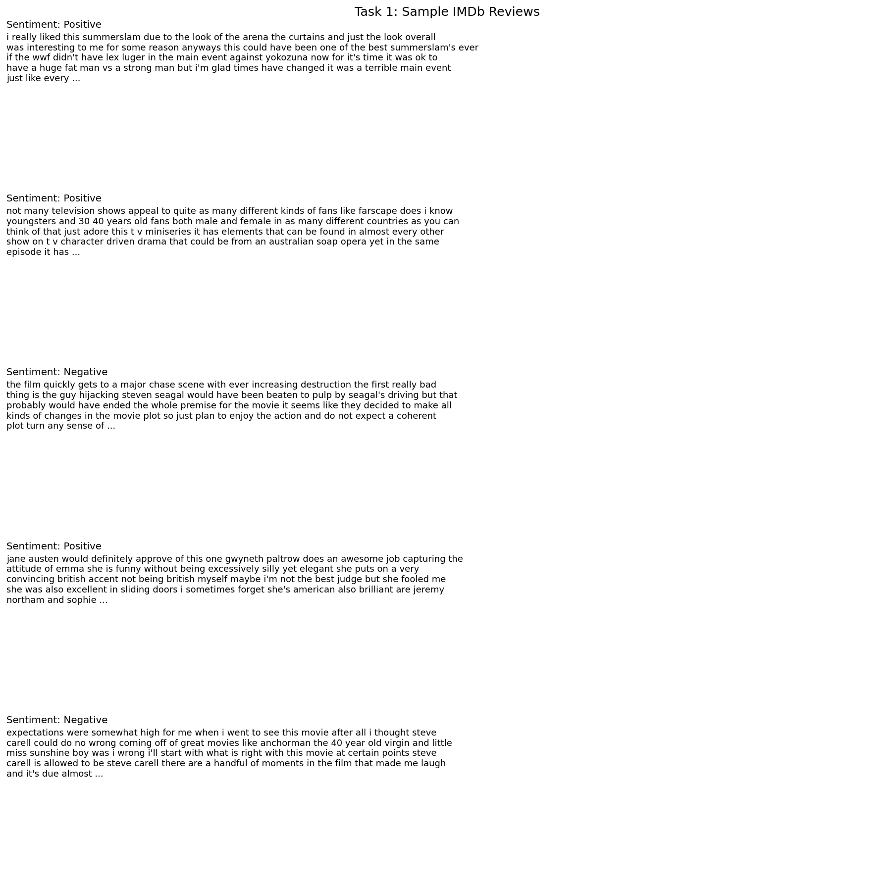
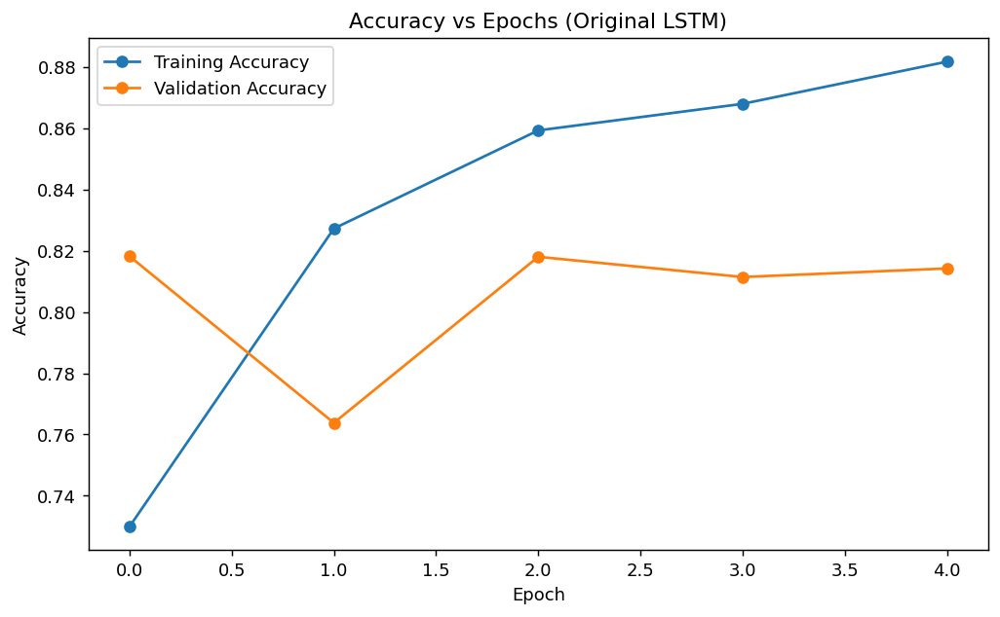
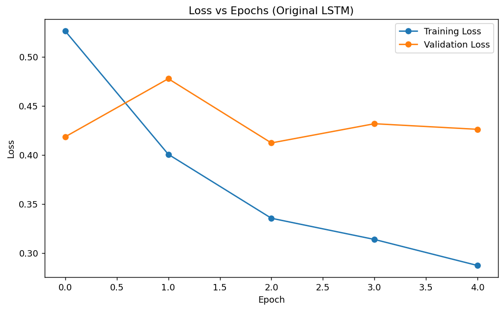

# Lab Report 10: LSTM-Based Sentiment Analysis on IMDb

---

**Course Code:** COMP-341L  
**Course Name:** Artificial Neural Networks Lab  
**Lab Number:** 10  
**Lab Title:** LSTM-Based Sentiment Analysis on Movie Reviews  
**Date:** April 20, 2026  
**Name:** Ali Hamza  
**Roll Number:** B23F0063AI106  
**Section:** B.S AI - Red

---

## Scenario
A startup needs an AI-powered movie review analysis system that can classify reviews as positive or negative. Traditional MLP-based models fail to capture context in text, especially phrases such as `not good`, and they cannot model long-term dependencies effectively. Therefore, this lab uses an LSTM model for sentiment analysis on the IMDb dataset.

---

## Task 1: Data Preprocessing
- **Dataset source:** Kaggle IMDb Dataset of 50K Movie Reviews (`IMDB Dataset.csv`)
- **Text cleaning:** lowercasing, removing HTML tags, and normalizing spaces
- **Tokenizer:** `Tokenizer(num_words=5000)`
- **Sequence length:** `100`
- **Train/Validation/Test split:** 40000 / 5000 / 5000

### Why padding is required
- Padding makes all sequences the same length so they can be stored in one tensor.
- If sequences have different lengths, batch training becomes difficult because the network expects consistent input shapes.
- Padding also lets us control how much context the model reads from each review.




---

## Task 2: Build LSTM Model
### Original model
```python
model = tf.keras.Sequential([
    tf.keras.layers.Embedding(input_dim=5000, output_dim=64, input_length=100),
    tf.keras.layers.LSTM(64),
    tf.keras.layers.Dense(1, activation='sigmoid')
])
```

### Explanation
- **Embedding layer:** converts word indices into dense vectors so semantically useful patterns can be learned.
- **Why LSTM is used instead of SimpleRNN:** LSTM handles long-term dependencies with gated memory and is better for contextual phrases.
- **Why sigmoid is used:** the output is binary, so sigmoid maps the prediction to a probability between 0 and 1.

---

## Task 3: Training and Evaluation
### Original model results
- Training accuracy: 0.8817
- Validation accuracy: 0.8142
- Training loss: 0.2873
- Validation loss: 0.4262
- Test accuracy: 0.8164
- Test loss: 0.4230

### Fit diagnosis
```text
Original model diagnosis: Overfitting
Train accuracy: 0.8817
Validation accuracy: 0.8142
Train loss: 0.2873
Validation loss: 0.4262

```




---

## Task 4: Parameter Modification
Two modifications were applied:
1. Increased LSTM units from `64` to `128`
2. Added dropout `0.3`

### Comparison table
```text
| Model    |   Train Acc |   Val Acc |   Test Acc |   Train Loss |   Val Loss |   Test Loss |
|:---------|------------:|----------:|-----------:|-------------:|-----------:|------------:|
| Original |      0.8817 |    0.8142 |     0.8164 |       0.2873 |     0.4262 |      0.4230 |
| Modified |      0.8826 |    0.8318 |     0.8318 |       0.2818 |     0.3979 |      0.4001 |
```


---

## Task 5: Prediction Test
Final model selected: **Modified**

```text
                                                          Review  Predicted Probability Predicted Sentiment
                               This movie was absolutely amazing               0.981877            Positive
                                  This movie was not good at all               0.261859            Negative
      The acting was great but the story was too slow and boring               0.054823            Negative
     I really loved the characters and the ending was satisfying               0.986291            Positive
I expected something better, and honestly it was a waste of time               0.016492            Negative
```

Interpretation:
- Probability close to 1 means the review is predicted as positive.
- Probability close to 0 means the review is predicted as negative.

### Final Evaluation
- Final test accuracy: 0.8318
- Final test loss: 0.4001


### Classification Report
```text
              precision    recall  f1-score   support

    Negative     0.7991    0.8864    0.8405      2500
    Positive     0.8725    0.7772    0.8221      2500

    accuracy                         0.8318      5000
   macro avg     0.8358    0.8318    0.8313      5000
weighted avg     0.8358    0.8318    0.8313      5000

```

---

## Required Visualizations
- Accuracy vs Epochs: `plots/task3_accuracy_curve.png`
- Loss vs Epochs: `plots/task3_loss_curve.png`

---

## Reflection Questions
1. **Why does LSTM perform better than SimpleRNN?**  
   LSTM performs better than SimpleRNN because it uses gated memory to keep useful information for longer parts of the sequence. That helps it understand context such as negation and word order, which is important in sentiment analysis.

2. **What role does memory cell play?**  
   The memory cell stores information across time steps so the network can remember earlier words while reading later words. This helps the model connect phrases like 'not good' instead of judging the word 'good' in isolation.

3. **Why is padding important in NLP tasks?**  
   Padding is important because neural networks train in batches, and every sample in a batch must have the same shape. Without padding, reviews of different lengths cannot be stacked into one regular tensor.

4. **What happens if sequence length is too small?**  
   If the sequence length is too small, the model will lose part of the review due to truncation. Important context near the end of long reviews may be removed, which can reduce sentiment accuracy.

5. **Why does increasing LSTM units improve performance (or not)?**  
   Increasing LSTM units can improve performance because the model gets more capacity to learn patterns and contextual dependencies. In this lab, the modified model reached validation accuracy 0.8318 compared with 0.8142 for the original model, so the larger LSTM helped on this dataset.

---

## Discussion
The original LSTM model achieved training accuracy 0.8817 and validation accuracy 0.8142 after 5 epochs. The training accuracy is noticeably higher than validation accuracy, and validation loss is worse than training loss, so the model is learning the training data more strongly than it generalizes. After increasing LSTM units from 64 to 128 and adding dropout 0.3, the modified model reached validation accuracy 0.8318 and test accuracy 0.8318. This shows that LSTM can capture context better than basic recurrent models, especially for phrases where sentiment depends on earlier words.

---

## Conclusion
In this lab, the IMDb movie review dataset was preprocessed with tokenization and padding, then classified with an LSTM network for binary sentiment analysis. The experiment showed why sequence models are better than traditional MLP-style text handling for understanding context and long-term dependencies. The final results also showed that increasing LSTM capacity and adding dropout can improve generalization when the baseline model is not strong enough.
