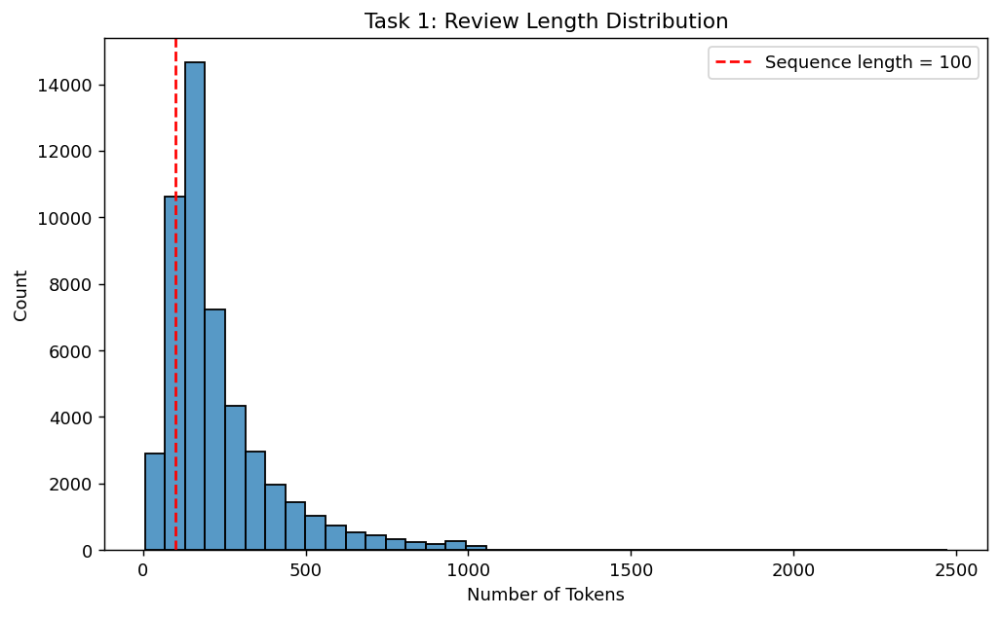
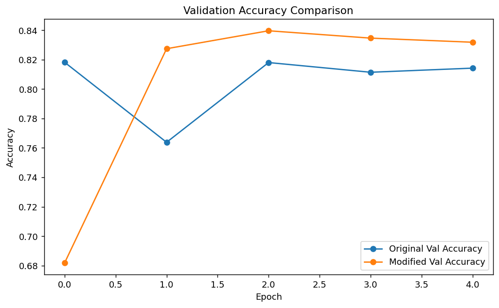
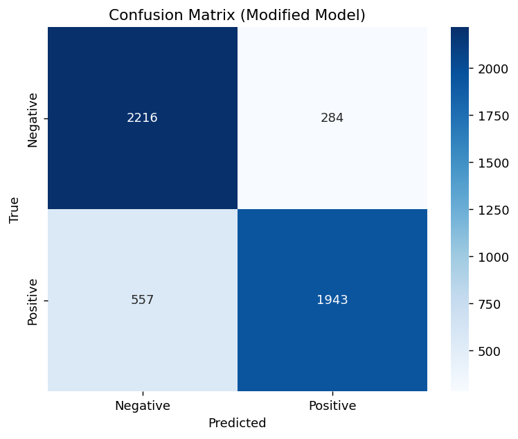

# Lab Report 10: Sentiment Classification with LSTM on IMDb Reviews

**Course Code:** COMP-341L  
**Course Title:** Artificial Neural Networks Lab  
**Lab Number:** 10  
**Experiment Theme:** LSTM-Based Sentiment Analysis  
**Student Name:** Zarmeena Jawad  
**Roll Number:** B23F0115AI125  
**Section:** B.S AI - Red  
**Date:** April 21, 2026

## Abstract
This lab studies binary sentiment classification using the IMDb movie review dataset and an LSTM-based neural
network. The experiment includes text cleaning, tokenization, sequence padding, baseline model training, model
adjustment, and final evaluation on unseen examples. The baseline configuration produced a test accuracy of 0.8164.
After increasing the LSTM hidden size and introducing dropout, the revised model achieved 0.8318 test accuracy. The
results show that LSTM networks are effective for sentiment tasks in which contextual order affects meaning.

## Keywords
LSTM, sentiment analysis, IMDb, text classification, recurrent neural networks, deep learning

## 1. Introduction
Sentiment classification aims to determine whether a text expresses positive or negative opinion. In this lab, the
task is to classify movie reviews from the IMDb dataset. A simple feedforward network is not ideal for this kind of
problem because it does not naturally capture word order. For example, the phrase `not good` carries negative meaning
even though the word `good` alone is positive.

To address this limitation, the lab uses a Long Short-Term Memory network. LSTM models are designed for sequence data
and can preserve useful information through gated memory. This makes them better suited to text classification tasks
where meaning depends on local and long-range context.

## 2. Data Preparation
The dataset contains 50,000 labeled movie reviews. Each review was cleaned before modeling. The preprocessing stage
included HTML removal, whitespace normalization, lowercasing, tokenization, and conversion to fixed-length padded
sequences.

### Preprocessing Setup
- Dataset file: `IMDB Dataset.csv`
- Vocabulary size: `5000`
- Sequence length: `100`
- Split ratio: `40000 / 5000 / 5000` for train, validation, and test
- Padding mode: `post`
- Truncation mode: `post`
- Label encoding: negative = 0, positive = 1

### Why Padding Is Needed
- Reviews have different lengths.
- Mini-batch learning requires a consistent tensor shape.
- Padding allows the model to process all samples in uniform form.
- A fixed sequence length also limits computational cost.




## 3. Model Design
The original network contains an Embedding layer, one LSTM layer, and a sigmoid output unit. The Embedding layer maps
tokens to dense vectors, the LSTM extracts sequential patterns, and the sigmoid layer outputs a probability for the
two sentiment classes.

```python
model = tf.keras.Sequential([
    tf.keras.layers.Embedding(input_dim=5000,
                              output_dim=64,
                              input_length=100),
    tf.keras.layers.LSTM(64),
    tf.keras.layers.Dense(1, activation='sigmoid')
])
```

The reusable model builder used in the notebook is:

```python
def build_lstm_model(max_len, lstm_units=64,
                     dropout_rate=0.0, learning_rate=1e-3):
    model = tf.keras.Sequential([
        tf.keras.layers.Embedding(input_dim=MAX_WORDS,
                                  output_dim=EMBEDDING_DIM,
                                  input_length=max_len),
        tf.keras.layers.LSTM(lstm_units, dropout=dropout_rate),
        tf.keras.layers.Dense(1, activation="sigmoid"),
    ])
    model.compile(optimizer=tf.keras.optimizers.Adam(learning_rate),
                  loss="binary_crossentropy",
                  metrics=["accuracy"])
    return model
```

## 4. Baseline Training Results
The initial model was trained for five epochs with batch size 32. Its results were:

- Training accuracy: 0.8817
- Validation accuracy: 0.8142
- Training loss: 0.2873
- Validation loss: 0.4262
- Test accuracy: 0.8164
- Test loss: 0.4230

These numbers indicate mild overfitting because training performance is stronger than validation performance.

```text
Original model diagnosis: Overfitting
Train accuracy: 0.8817
Validation accuracy: 0.8142
Train loss: 0.2873
Validation loss: 0.4262
```


## 5. Model Modification
Two changes were introduced to improve the model:

1. Increase LSTM units from `64` to `128`
2. Add dropout with value `0.3`

The updated configuration was:

```python
modified_model = build_lstm_model(
    max_len=100,
    lstm_units=128,
    dropout_rate=0.3,
)
```

### Performance Comparison

| Model | Train Acc | Val Acc | Test Acc | Train Loss | Val Loss | Test Loss |
| --- | ---: | ---: | ---: | ---: | ---: | ---: |
| Original | 0.8817 | 0.8142 | 0.8164 | 0.2873 | 0.4262 | 0.4230 |
| Modified | 0.8826 | 0.8318 | 0.8318 | 0.2818 | 0.3979 | 0.4001 |

The modified version improved both validation and test accuracy by 0.0176, indicating better generalization.



## 6. Final Evaluation
The modified LSTM was selected as the final model because it achieved the best validation score. It was then tested on
custom review statements and on the held-out test set.

### Custom Prediction Output

| Review | Predicted Probability | Predicted Sentiment |
| --- | ---: | --- |
| This movie was absolutely amazing | 0.9819 | Positive |
| This movie was not good at all | 0.2619 | Negative |
| The acting was great but the story was too slow and boring | 0.0548 | Negative |
| I really loved the characters and the ending was satisfying | 0.9863 | Positive |
| I expected something better, and honestly it was a waste of time | 0.0165 | Negative |

### Test Summary
- Final model: Modified LSTM
- Final test accuracy: 0.8318
- Final test loss: 0.4001
- Decision rule: probability >= 0.5 implies positive sentiment



### Classification Report
```text
              precision    recall  f1-score   support

    Negative     0.7991    0.8864    0.8405      2500
    Positive     0.8725    0.7772    0.8221      2500

    accuracy                         0.8318      5000
   macro avg     0.8358    0.8318    0.8313      5000
weighted avg     0.8358    0.8318    0.8313      5000
```

The final system is slightly stronger at identifying negative reviews because its recall for the negative class is
higher than for the positive class.

## 7. Discussion
LSTM performs better than a SimpleRNN because it uses gated memory to preserve meaningful signals across longer text
sequences. The memory cell helps the model connect earlier and later words, which is essential in phrases where
negation changes sentiment. Padding is important because variable-length reviews cannot be arranged into a regular
training tensor without it. Increasing the number of LSTM units increases the capacity of the model, and in this
experiment the additional capacity combined with dropout improved generalization.

## 8. Conclusion
This lab demonstrated how an LSTM network can be applied to sentiment analysis on IMDb reviews. The full workflow
included cleaning text, producing padded token sequences, training a baseline model, and then refining the model by
adjusting its architecture. The updated model performed better than the original baseline and reached 83.18% test
accuracy, confirming that sequential models are effective when classification depends on contextual word relationships.
