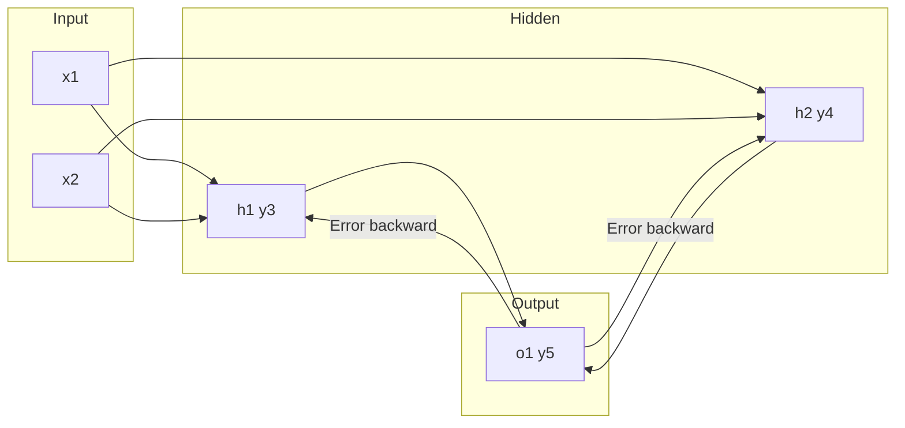

# Lab Report 4: Backpropagation Step-by-Step

---

**Course Code:** COMP-341L  
**Course Name:** Artificial Neural Networks Lab  
**Lab Number:** 4  
**Lab Title:** Backpropagation (Manual Analysis)  
**Date:** February 10, 2026

**Name:** Ali Hamza  
**Roll Number:** B23F0063AI106  
**Section:** B.S AI - Red

---

**Academic integrity:** This report and the conclusion are written in my own words. I have not copied from colleagues or submitted anyone else’s work. Plagiarism, copy-pasting, or submitting a colleague’s report results in zero marks for all involved (as per course policy).

---

## Objective

To manually trace one iteration of backpropagation on a small neural network: forward pass, error calculation, output and hidden deltas, and weight updates. To interpret the results and reflect on backpropagation as blame assignment.

---

## Network (from Lab 04.pdf)

- **Inputs:** \(x_1 = 0.35\), \(x_2 = 0.7\)
- **Weights:** \(w_{1,1}=0.2\), \(w_{2,1}=0.2\), \(w_{1,2}=0.3\), \(w_{2,2}=0.3\), \(w_{1,3}=0.3\), \(w_{2,3}=0.9\)
- **Target:** \(y_{\text{target}} = 0.5\); **Learning rate:** \(\eta = 1\); **Activation:** Sigmoid
- **Notation:** Hidden outputs \(y_3\) (h1), \(y_4\) (h2); output \(y_5\) (o1)



---

## Task 1: Forward Pass Analysis (Understanding the Prediction)

### Steps

1. **Weighted sum at each hidden neuron**
   - \(a_1 = w_{1,1} x_1 + w_{2,1} x_2 = 0.2 \times 0.35 + 0.2 \times 0.7 = 0.21\)
   - \(a_2 = w_{1,2} x_1 + w_{2,2} x_2 = 0.3 \times 0.35 + 0.3 \times 0.7 = 0.315\)

2. **Sigmoid at hidden layer**
   - \(y_3 = \sigma(a_1) = \frac{1}{1+e^{-a_1}} \approx 0.552\)
   - \(y_4 = \sigma(a_2) \approx 0.578\)

3. **Weighted sum and output at output neuron**
   - \(a_3 = w_{1,3} y_3 + w_{2,3} y_4 = 0.3 \times 0.552 + 0.9 \times 0.578 \approx 0.686\)
   - \(y_5 = \sigma(a_3) \approx 0.665\)

4. **Comparison**
   - Target = 0.5, predicted \(y_5 \approx 0.665\) → prediction is **incorrect**.

### Code description (Task 1)

Relevant snippets from `backprop_manual_calc.py`:

```python
def sigmoid(x):
    return 1 / (1 + math.exp(-x))
```

```python
a1 = w11 * x1 + w21 * x2
a2 = w12 * x1 + w22 * x2
y3 = sigmoid(a1)
y4 = sigmoid(a2)
```

```python
a3 = w13 * y3 + w23 * y4
y5 = sigmoid(a3)
```

The script prints each step and compares `y5` to the target so we can see the prediction is wrong.

### Conceptual: Why is the network's prediction considered incorrect?

The prediction is incorrect because \(y_5 \neq y_{\text{target}}\). The network output (0.665) is higher than the target (0.5), so the model overestimated the risk score for this input.

**Figure 1.1:** Task 1 – Forward pass (see [screenshots/task1_forward_pass.png](screenshots/task1_forward_pass.png))

---

## Task 2: Error Calculation (Identifying the Mistake)

### Computation

\[
\text{Error} = y_{\text{target}} - y_5 = 0.5 - 0.665 = -0.165
\]

### Code description (Task 2)

Relevant snippet:

```python
error = y_target - y5
```

The script prints this value and explains that a negative error means the prediction is too high.

### Conceptual: What does the sign of the error tell you about the prediction?

A **negative** error means the predicted value \(y_5\) is **greater** than the target. So the network predicted too high; we need to reduce the output toward 0.5. The magnitude (0.165) indicates how far the prediction is from the target.

**Figure 2.1:** Task 2 – Error calculation (see [screenshots/task2_error_calculation.png](screenshots/task2_error_calculation.png))

---

## Task 3: Output Neuron Responsibility (δ₅)

### Computation

\[
\delta_5 = y_5 (1 - y_5) (y_{\text{target}} - y_5)
\]

\[
\delta_5 = 0.665 \times (1 - 0.665) \times (0.5 - 0.665) = 0.665 \times 0.335 \times (-0.165) \approx -0.037
\]

### Code description (Task 3)

Relevant snippet (sigmoid derivative × error):

```python
delta5 = y5 * (1 - y5) * (y_target - y5)
```

The term `y5 * (1 - y5)` is the derivative of the sigmoid. The script prints the formula and the numerical result.

### Conceptual: Why do we multiply the error with the derivative of the sigmoid function?

We multiply the error by the derivative \(\sigma'(a) = y(1-y)\) because of the **chain rule**: we need the gradient of the loss with respect to the **pre-activation** (weighted sum) of the output neuron, not just the error at its output. The derivative tells us how sensitive the output is to a small change in the input; combining it with the error gives the correct “responsibility” (delta) for that neuron. Neurons near saturation (output near 0 or 1) have small \(y(1-y)\), so they learn slowly.

**Figure 3.1:** Task 3 – Output delta (see [screenshots/task3_output_delta.png](screenshots/task3_output_delta.png))

---

## Task 4: Hidden Neuron Responsibility (δ₃ and δ₄)

### Computation

\[
\delta_j = y_j (1 - y_j) (w_{j,\text{output}} \times \delta_5)
\]

- \(\delta_3 = y_3(1-y_3)(w_{1,3} \times \delta_5) = 0.552 \times 0.448 \times (0.3 \times (-0.037)) \approx -0.0027\)
- \(\delta_4 = y_4(1-y_4)(w_{2,3} \times \delta_5) = 0.578 \times 0.422 \times (0.9 \times (-0.037)) \approx -0.0081\)

### Code description (Task 4)

Relevant snippets (backprop from output to hidden):

```python
delta3 = y3 * (1 - y3) * (w13 * delta5)
delta4 = y4 * (1 - y4) * (w23 * delta5)
```

`w13` and `w23` are the weights from hidden to output; the script prints both deltas.

### Conceptual

**Why do hidden neurons not directly use the target value?**  
Hidden neurons do not have a direct target; only the output layer does. Their responsibility is computed by **backpropagating** the output error: each hidden neuron’s delta is the output delta (\(\delta_5\)) weighted by how much that hidden neuron’s output affects the final output (via the weight to the output). So blame is assigned backward using the chain rule, not using the target.

**Why does a larger outgoing weight result in a larger hidden error?**  
A larger weight \(w_{j,\text{output}}\) means that neuron’s output has a **stronger influence** on the final output. So when the output is wrong, that hidden neuron is assigned more of the blame; hence \(\delta_j\) is larger in magnitude when \(w_{j,\text{output}}\) is larger.

**Figure 4.1:** Task 4 – Hidden deltas (see [screenshots/task4_hidden_deltas.png](screenshots/task4_hidden_deltas.png))

---

## Task 5: Weight Updates (Learning from Mistakes)

### Formula

\[
\Delta w = \eta \times \delta \times \text{input}
\]

### Hidden → Output

- \(\Delta w_{1,3} = \eta \times \delta_5 \times y_3 = 1 \times (-0.037) \times 0.552 \approx -0.020\)
- \(\Delta w_{2,3} = \eta \times \delta_5 \times y_4 = 1 \times (-0.037) \times 0.578 \approx -0.021\)
- New: \(w_{1,3} \approx 0.280\), \(w_{2,3} \approx 0.879\)

### Input → Hidden

- \(\Delta w_{1,1} = \eta \times \delta_3 \times x_1 \approx -0.001\), \(\Delta w_{2,1} = \eta \times \delta_3 \times x_2 \approx -0.002\)
- \(\Delta w_{1,2} = \eta \times \delta_4 \times x_1 \approx -0.003\), \(\Delta w_{2,2} = \eta \times \delta_4 \times x_2 \approx -0.006\)
- New: \(w_{1,1} \approx 0.199\), \(w_{2,1} \approx 0.198\), \(w_{1,2} \approx 0.297\), \(w_{2,2} \approx 0.294\)

### Code description (Task 5)

Relevant snippets (Δw = η × δ × input):

Hidden → output:

```python
dw13 = eta * delta5 * y3
dw23 = eta * delta5 * y4
w13_new = w13 + dw13
w23_new = w23 + dw23
```

Input → hidden:

```python
dw11 = eta * delta3 * x1
dw21 = eta * delta3 * x2
dw12 = eta * delta4 * x1
dw22 = eta * delta4 * x2
```

The script prints each Δw and each new weight.

### Conceptual

**Why do some weights change more than others?**  
The update is \(\Delta w = \eta \times \delta \times \text{input}\). So weights change more when (1) the **delta** (responsibility) is larger, and/or (2) the **input** to that weight is larger. Weights on connections that contributed more to the error (larger \(\delta\)) or that had a stronger signal (larger input) get larger updates.

**Why are some weight updates very small?**  
Updates are small when \(\delta\) is small (neuron has little blame), when the input is small (weak signal), or when the neuron is near saturation so \(y(1-y)\) is small. For example, \(\delta_3\) is small, so input–hidden weights connected to h1 get very small updates.

**Figure 5.1:** Task 5 – Weight updates (see [screenshots/task5_weight_updates.png](screenshots/task5_weight_updates.png))

---

## Task 6: Interpretation & Reflection (Critical Thinking)

### 1. Explain backpropagation as a process of blame assignment.

Backpropagation assigns “blame” for the output error to each neuron and weight. The output neuron gets blame proportional to the error and its sensitivity (sigmoid derivative). That blame is then passed backward: each hidden neuron gets a share of the output’s blame weighted by how much its output affected the final answer (the weight to the output). So we ask: “Who contributed to this mistake, and by how much?” The deltas (\(\delta\)) are those blame amounts; they are then used to update weights so that next time the network moves in the direction that reduces the error.

### 2. What would happen if the learning rate was very large? Very small?

- **Very large learning rate:** Updates \(\Delta w\) would be too big. The network could overshoot good solutions, oscillate, or diverge. Training becomes unstable and may not converge.
- **Very small learning rate:** Updates would be tiny. The network would improve very slowly, need many more epochs to converge, and might get stuck in poor local minima or never reach a good solution in practice.

### 3. Why is backpropagation called "backward" propagation?

Because the **error** (and the gradient) is propagated **backward** through the network: from the output layer toward the input layer. In the forward pass, activations flow input → hidden → output. In the backward pass, we compute how much each layer contributed to the error, starting from the output and moving back through hidden layers to the inputs. So “backward” refers to this direction of error (and gradient) flow, opposite to the forward flow of activations.

**Figure 6.1:** Task 6 – Reflection (see [screenshots/task6_reflection.png](screenshots/task6_reflection.png) if captured)

---

## Results (Screenshots)

| Task | Description | Screenshot |
|------|-------------|------------|
| Task 1 | Forward pass: weighted sums, sigmoid, output \(y_5\) vs target | [task1_forward_pass.png](screenshots/task1_forward_pass.png) |
| Task 2 | Error = \(y_{\text{target}} - y_5\) and sign interpretation | [task2_error_calculation.png](screenshots/task2_error_calculation.png) |
| Task 3 | Output delta \(\delta_5\) and derivative interpretation | [task3_output_delta.png](screenshots/task3_output_delta.png) |
| Task 4 | Hidden deltas \(\delta_3\), \(\delta_4\) and conceptual answers | [task4_hidden_deltas.png](screenshots/task4_hidden_deltas.png) |
| Task 5 | Weight updates \(\Delta w\) and new weights | [task5_weight_updates.png](screenshots/task5_weight_updates.png) |
| Task 6 | Reflection (optional screenshot) | [task6_reflection.png](screenshots/task6_reflection.png) |

Screenshots were captured from the terminal output of `backprop_manual_calc.py` (one section per task). Run the script from this folder (using the project venv: `../../venv/bin/python3 backprop_manual_calc.py`) to reproduce the results.

---

## Conclusion

In this lab I worked through one full step of backpropagation by hand on a small network. I saw how the forward pass gives a prediction, how we measure the mistake with the error, and how we assign responsibility to the output neuron using the error and the sigmoid derivative. Then the important part: passing that responsibility backward to the hidden layer using the weights that connect them to the output, so each hidden neuron gets a share of the blame. Finally, every weight is updated using the rule “learning rate × responsibility × input,” which made it clear why some weights change a lot and others barely move.

Doing the numbers myself (and checking them with the script) helped me understand that backpropagation is not a black box—it is just the chain rule applied step by step, and the “backward” name comes from the fact that we start at the output and work back toward the inputs. I also saw how the learning rate controls the size of each step: too big and we overshoot, too small and we hardly learn. This will help when I use libraries that do backprop automatically, because I know what is happening underneath.

---

## References

- Lab 04 Manual (Lab 04.pdf), LAB TASKS, pages 16–18.
