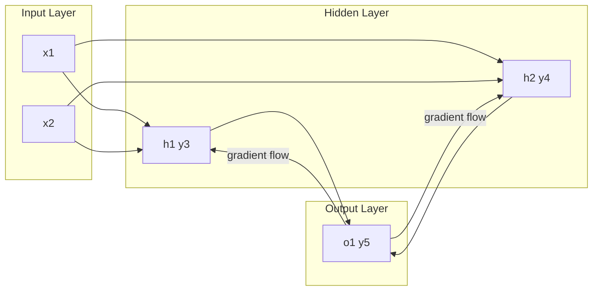

# Laboratory Report 4: Backpropagation Manual Analysis

---

**Course:** COMP-341L - Artificial Neural Networks Lab  
**Lab Assignment:** 4  
**Topic:** Backpropagation and Its Implementation from Scratch  
**Submission Date:** February 10, 2026

**Student Name:** Zarmeena Jawad  
**Roll Number:** B23F0115AI125  
**Section:** AI Red

---

**Academic integrity:** I declare that this report is my own work. I have not copied from other students or submitted another person’s report. As per course policy, plagiarism or copy-pasting leads to zero marks for everyone involved.

---

## Executive Summary

This laboratory involves tracing a single iteration of the backpropagation algorithm by hand on a small feedforward network. The work includes computing the forward pass to obtain a prediction, measuring the output error, computing responsibility terms (deltas) for the output and hidden units, and applying the weight-update rule. The report documents each step with the same network parameters as the lab manual and reflects on how error is distributed backward and how the learning rate affects training.

---

## Learning Objectives

Upon completion of this lab, students should be able to:

- Compute weighted sums and sigmoid activations for a given network (forward pass)
- Compute the output error and interpret its sign and magnitude
- Derive the error term (delta) for the output neuron using the sigmoid derivative
- Compute deltas for hidden neurons by propagating the output delta backward
- Apply the weight-update rule \(\Delta w = \eta \times \delta \times \text{input}\) for all connections
- Explain how backpropagation distributes responsibility and why it is called “backward” propagation
- Describe the effect of very large and very small learning rates on training

---

## Methodology

Calculations follow the network and formulae given in Lab 04 (Lab 04.pdf). All numerical values were computed by hand and cross-checked with a Python script (`backprop_trace.py`) that implements the same steps with identical parameters. Screenshots of the script output are included for each task.

---

## Network Specification (Lab 04.pdf)

- **Input layer:** \(x_1 = 0.35\), \(x_2 = 0.7\)
- **Weights:** \(w_{1,1}=0.2\), \(w_{2,1}=0.2\), \(w_{1,2}=0.3\), \(w_{2,2}=0.3\), \(w_{1,3}=0.3\), \(w_{2,3}=0.9\)
- **Target:** 0.5 | **Learning rate \(\eta\):** 1 | **Activation:** Sigmoid
- **Hidden layer** outputs: \(y_3\) (unit h1), \(y_4\) (unit h2) | **Output layer:** \(y_5\) (unit o1)



---

## Task 1: Forward Pass Analysis (Understanding the Prediction)

### Purpose

Obtain the network’s prediction by computing weighted sums at the hidden and output layers and applying the sigmoid activation, then compare the result to the target.

### Computation

1. **Weighted sums at hidden units**
   - \(a_1 = w_{1,1} x_1 + w_{2,1} x_2 = 0.2 \times 0.35 + 0.2 \times 0.7 = 0.21\)
   - \(a_2 = w_{1,2} x_1 + w_{2,2} x_2 = 0.315\)

2. **Sigmoid at hidden layer:** \(y_3 = \sigma(a_1) \approx 0.552\), \(y_4 = \sigma(a_2) \approx 0.578\)

3. **Output layer:** \(a_3 = w_{1,3} y_3 + w_{2,3} y_4 \approx 0.686\), \(y_5 = \sigma(a_3) \approx 0.665\)

4. **Comparison:** Target = 0.5, predicted \(y_5 \approx 0.665\) → **mismatch** (prediction does not equal target).

### Code description (Task 1)

The script uses variable names `net_h1`, `net_h2` for the hidden-layer weighted sums and `out_h1`, `out_h2` for the hidden activations. The output layer uses `net_out` and `y_pred`.

```python
def sigmoid(z):
    return 1 / (1 + math.exp(-z))
```

```python
net_h1 = w11 * x1 + w21 * x2
net_h2 = w12 * x1 + w22 * x2
out_h1 = sigmoid(net_h1)
out_h2 = sigmoid(net_h2)
```

```python
net_out = w13 * out_h1 + w23 * out_h2
y_pred = sigmoid(net_out)
```

### Conceptual: Why is the network’s prediction considered incorrect?

The value produced by the network (0.665) is not equal to the desired target (0.5). The model’s output lies above the target, so for this input the risk score is too high and the prediction is wrong.

**Figure 1.1:** Task 1 – Forward pass ([screenshots/task1_forward_pass.png](screenshots/task1_forward_pass.png))

---

## Task 2: Error Calculation (Identifying the Mistake)

### Computation

\[
\text{Error} = y\_{\text{target}} - y_5 = 0.5 - 0.665 = -0.165
\]

### Code description (Task 2)

The script stores the error in `err` and prints it:

```python
err = target - y_pred
```

### Conceptual: What does the sign of the error tell you about the prediction?

When the error is **negative**, the network’s output is **above** the target. So we must lower the output in the next update. The absolute value of the error (0.165) shows how much the prediction deviates from the target.

**Figure 2.1:** Task 2 – Error calculation ([screenshots/task2_error_calculation.png](screenshots/task2_error_calculation.png))

---

## Task 3: Output Neuron Responsibility (δ₅)

### Computation

\[
\delta_5 = y_5 (1 - y_5) (y_{\text{target}} - y_5) = 0.665 \times 0.335 \times (-0.165) \approx -0.037
\]

### Code description (Task 3)

The output delta is computed and stored in `d_out`:

```python
d_out = y_pred * (1 - y_pred) * (target - y_pred)
```

The factor \(y(1-y)\) is the derivative of the sigmoid; the script prints the numerical value.

### Conceptual: Why do we multiply the error with the derivative of the sigmoid function?

The gradient we need for updating weights is with respect to the **weighted sum** (pre-activation) of the neuron, not just the error at its output. The chain rule requires multiplying the error by the derivative of the activation. For sigmoid, that derivative is \(y(1-y)\). It measures how much the output changes for a small change in the input; together with the error it gives the correct delta. When the output is near 0 or 1, \(y(1-y)\) is small, so those neurons receive smaller updates.

**Figure 3.1:** Task 3 – Output delta ([screenshots/task3_output_delta.png](screenshots/task3_output_delta.png))

---

## Task 4: Hidden Neuron Responsibility (δ₃ and δ₄)

### Computation

\[
\delta_j = y_j (1 - y_j) (w_{j,\text{output}} \times \delta_5)
\]

- \(\delta_3 \approx -0.0027\), \(\delta_4 \approx -0.0081\)

### Code description (Task 4)

Hidden deltas use `d_h1` and `d_h2`, with weights `w13` and `w23` to the output:

```python
d_h1 = out_h1 * (1 - out_h1) * (w13 * d_out)
d_h2 = out_h2 * (1 - out_h2) * (w23 * d_out)
```

### Conceptual

**Why do hidden neurons not directly use the target value?**  
Only the output layer has a direct target. Hidden units do not; their contribution to the error is found by **sending the output delta backward** along the weights. Each hidden unit’s delta is the output delta scaled by the weight that connects that unit to the output and by the sigmoid derivative at that unit. So responsibility is computed recursively from the output inward, not from the target.

**Why does a larger outgoing weight result in a larger hidden error?**  
A larger weight from a hidden unit to the output means that unit’s activation has a **greater effect** on the final output. When the output is wrong, that hidden unit is assigned a larger share of the responsibility, so its delta is larger in magnitude.

**Figure 4.1:** Task 4 – Hidden deltas ([screenshots/task4_hidden_deltas.png](screenshots/task4_hidden_deltas.png))

---

## Task 5: Weight Updates (Learning from Mistakes)

### Formula

\[
\Delta w = \eta \times \delta \times \text{input}
\]

### Hidden → Output

- \(\Delta w_{1,3} \approx -0.020\), \(\Delta w_{2,3} \approx -0.021\) → updated \(w_{1,3} \approx 0.280\), \(w_{2,3} \approx 0.879\)

### Input → Hidden

- \(\Delta w_{1,1}, \Delta w_{2,1}, \Delta w_{1,2}, \Delta w_{2,2}\) as in manual → updated weights \(w_{1,1} \approx 0.199\), \(w_{2,1} \approx 0.198\), \(w_{1,2} \approx 0.297\), \(w_{2,2} \approx 0.294\)

### Code description (Task 5)

Weight changes use names like `d_w13`, `d_w23`; updated weights use `w13_updated`, etc.:

Hidden to output:

```python
d_w13 = eta * d_out * out_h1
d_w23 = eta * d_out * out_h2
w13_updated = w13 + d_w13
w23_updated = w23 + d_w23
```

Input to hidden:

```python
d_w11 = eta * d_h1 * x1
d_w21 = eta * d_h1 * x2
d_w12 = eta * d_h2 * x1
d_w22 = eta * d_h2 * x2
```

### Conceptual

**Why do some weights change more than others?**  
The update is \(\eta \times \delta \times \text{input}\). So a weight changes more if the unit’s delta is larger (more responsibility) or if the input to that weight is larger (stronger signal). Connections that contributed more to the error or carried a stronger activation get bigger updates.

**Why are some weight updates very small?**  
Updates are small when the delta is small (the unit had little responsibility), when the input is small, or when the unit is near saturation so \(y(1-y)\) is small. For instance, \(\delta_3\) is small, so the weights from the inputs to h1 change only slightly.

**Figure 5.1:** Task 5 – Weight updates ([screenshots/task5_weight_updates.png](screenshots/task5_weight_updates.png))

---

## Task 6: Interpretation & Reflection (Critical Thinking)

### 1. Explain backpropagation as a process of blame assignment.

Backpropagation determines how much each unit and each weight contributed to the output error. The output unit’s responsibility is given by the error and the sigmoid derivative. That responsibility is then **passed backward**: each hidden unit receives a portion of the output unit’s responsibility, weighted by the connection strength to the output. So we ask which parts of the network are most responsible for the mistake. The deltas are those responsibility values and are used to update the weights so that the next forward pass reduces the error.

### 2. What would happen if the learning rate was very large? Very small?

- **Very large \(\eta\):** Weight changes would be too large. The network could jump past good solutions, oscillate, or fail to converge. Training would be unstable.
- **Very small \(\eta\):** Weight changes would be tiny. The network would improve very slowly and might need a very large number of epochs to reach a good solution, or might get stuck in a poor region.

### 3. Why is backpropagation called “backward” propagation?

The **error and the gradients** are passed **from the output layer back toward the input layer**. In the forward direction, activations go from inputs to hidden to output. In the backward direction, we compute how much each layer contributed to the error, starting at the output and moving backward through the hidden layers. So “backward” refers to this direction of gradient flow, opposite to the flow of activations.

**Figure 6.1:** Task 6 – Reflection ([screenshots/task6_reflection.png](screenshots/task6_reflection.png))

---

## Results Summary

- **Task 1:** Forward pass computed; weighted sums and sigmoid activations at hidden and output; prediction \(y_5 \approx 0.665\) vs target 0.5. Screenshot: [task1_forward_pass.png](screenshots/task1_forward_pass.png).
- **Task 2:** Output error computed: \(-0.165\); sign and magnitude interpreted. Screenshot: [task2_error_calculation.png](screenshots/task2_error_calculation.png).
- **Task 3:** Output neuron delta \(\delta_5 \approx -0.037\) computed; role of sigmoid derivative explained. Screenshot: [task3_output_delta.png](screenshots/task3_output_delta.png).
- **Task 4:** Hidden deltas \(\delta_3\), \(\delta_4\) computed; conceptual answers on target and outgoing weights. Screenshot: [task4_hidden_deltas.png](screenshots/task4_hidden_deltas.png).
- **Task 5:** All weight updates applied; new weights recorded. Screenshot: [task5_weight_updates.png](screenshots/task5_weight_updates.png).
- **Task 6:** Reflection on responsibility, learning rate, and “backward” propagation. Screenshot: [task6_reflection.png](screenshots/task6_reflection.png).

Screenshots were produced by running `backprop_trace.py` from this folder (using the project venv: `../../venv/bin/python3 backprop_trace.py`).

---

## Conclusion

This lab required carrying out one full iteration of backpropagation by hand on a small network. I computed the forward pass to get the prediction, then the error between the target and the output. Next I found the output unit’s delta using the error and the sigmoid derivative, and then propagated that delta backward to the hidden units using the weights connecting them to the output. Finally I applied the update rule for every weight: learning rate times delta times input. Seeing which weights changed more and which changed very little made it clear that responsibility and signal strength both play a role.

Working through the formulae step by step showed that backpropagation is the chain rule applied layer by layer: we start from the output error and work backward to get the gradient at each weight. The name “backward” propagation comes from this direction of flow. I also saw that the learning rate controls step size: too large and updates can destabilize training; too small and progress is slow. Having done the calculations manually will help me understand what automatic differentiation and optimizers are doing when I use them in practice.

---

## References

1. Lab 04 Manual (Lab 04.pdf), LAB TASKS, pages 16–18.

---

**Report Prepared By:** Zarmeena Jawad  
**Roll Number:** B23F0115AI125  
**Section:** AI Red  
**Date:** February 10, 2026
