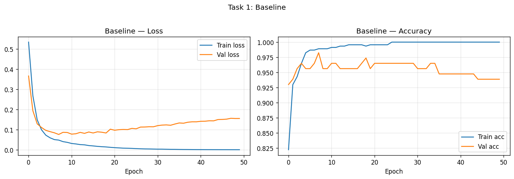
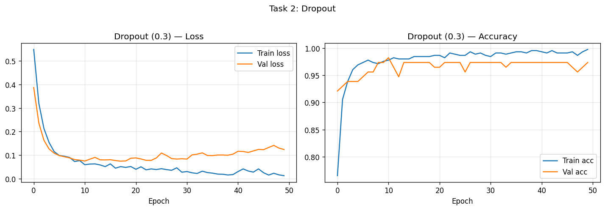
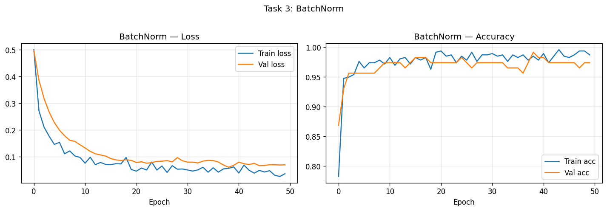
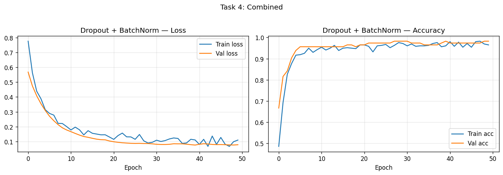
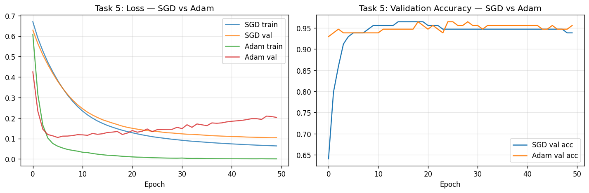
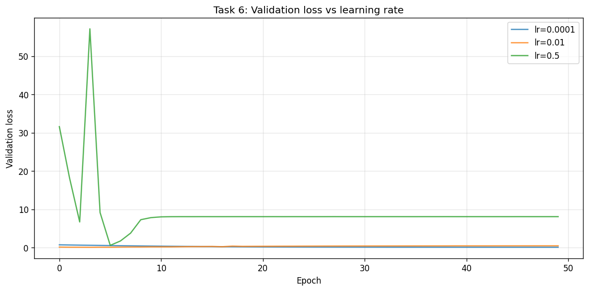

# Lab Report 5: Dropout, Batch Normalization, and Optimizers

---

**Course Code:** COMP-341L  
**Course Name:** Artificial Neural Networks Lab  
**Lab Number:** 5  
**Lab Title:** Implementing Dropout, Batch Normalization, and Optimizers  
**Date:** February 16, 2026

**Name:** Ali Hamza  
**Roll Number:** B23F0063AI106  
**Section:** B.S AI - Red

---

**Academic integrity:** This report and the conclusion are written in my own words. I have not copied from colleagues or submitted anyone else's work. Plagiarism, copy-pasting, or submitting a colleague's report results in zero marks for all involved (as per course policy).

---

## Objective

To build deep neural networks with TensorFlow on the Breast Cancer dataset; to implement and compare Dropout, Batch Normalization, and their combination; to compare SGD and Adam optimizers; and to observe learning rate sensitivity (instability or divergence). Validation curves are used to diagnose overfitting and analyze training stability.

---

## Dataset and Setup

- **Dataset:** Breast Cancer (sklearn). Binary classification (malignant / benign).
- **Preprocessing:** Train/validation split 80/20, stratified; features standardized with `StandardScaler`.
- **Architecture (base):** Input → Dense(64, ReLU) → Dense(64, ReLU) → Dense(32, ReLU) → Dense(1, sigmoid).
- **Training:** 50 epochs, batch size 32, binary cross-entropy loss. Adam default LR 0.001 unless stated; SGD uses 0.01 for comparison.

All code is in `lab5_tasks.py`. Run from project root:  
`./venv/bin/python3 "Lab 5/Ali Hamza's Lab/lab5_tasks.py"`  
or from this folder: `../../venv/bin/python3 lab5_tasks.py`

---

## Task 1: Baseline Model (No Dropout, No BatchNorm)

As required by the manual: build a deep network **without** Dropout or BatchNorm, train for **50 epochs**, and **plot training loss, validation loss, and accuracy**. Results are recorded in the Comparison Table and below.

### Code (relevant)

```python
def build_baseline(input_dim=INPUT_DIM):
    return keras.Sequential([
        layers.Input(shape=(input_dim,)),
        layers.Dense(64, activation="relu"),
        layers.Dense(64, activation="relu"),
        layers.Dense(32, activation="relu"),
        layers.Dense(1, activation="sigmoid"),
    ], name="baseline")
```

### Results

The baseline shows a gap between training and validation loss (overfitting): training loss keeps decreasing while validation loss can flatten or increase.

**Figure 1.1:** Task 1 – Training loss, validation loss, and accuracy (as per Lab 05 requirements).



---

## Task 2: Add Dropout

As required: modify the model by adding Dropout (rate 0.3 after each hidden layer), train again, and **compare overfitting behavior and accuracy** with the baseline.

### Code (relevant)

```python
layers.Dense(64, activation="relu"),
layers.Dropout(rate),
layers.Dense(64, activation="relu"),
layers.Dropout(rate),
...
```

### Comparison with baseline (overfitting behavior, accuracy)

- **Overfitting behavior:** Validation loss tracks training loss better; the train–val gap is reduced because dropout prevents over-reliance on specific neurons.
- **Accuracy:** Validation accuracy improves (see Comparison Table); training accuracy is lower than baseline due to regularization.

**Figure 2.1:** Task 2 – Dropout (loss and accuracy).



---

## Task 3: Add BatchNorm

As required: add BatchNorm to the model (after each Dense, before ReLU). Train and **compare convergence speed, stability, and final performance**.

### Code (relevant)

```python
layers.Dense(64),
layers.BatchNormalization(),
layers.Activation("relu"),
...
```

### Comparison (convergence speed, stability, final performance)

- **Convergence speed:** Loss decreases faster and more smoothly because internal covariate shift is reduced.
- **Stability:** Training curves are smoother and less noisy.
- **Final performance:** Validation accuracy and loss improve (see Comparison Table).

**Figure 3.1:** Task 3 – BatchNorm (loss and accuracy).



---

## Task 4: Combine Dropout + BatchNorm

As required: combine Dropout and BatchNorm in the same model, train, and analyze.

### Code (relevant)

```python
layers.Dense(64),
layers.BatchNormalization(),
layers.Activation("relu"),
layers.Dropout(rate),
...
```

### Analysis

BatchNorm stabilizes layer inputs; Dropout regularizes. The combined model gives the best validation accuracy in our run (see Comparison Table), with stable and smooth loss curves.

**Figure 4.1:** Task 4 – Dropout + BatchNorm (loss and accuracy).



---

## Task 5: Optimizer Comparison (SGD vs Adam)

As required: train the **same architecture** with **SGD** and **Adam**, **plot loss curves on the same graph**, and **compare speed, smoothness, and final performance**.

- **SGD:** learning rate 0.01  
- **Adam:** learning rate 0.001  

### Code (relevant)

```python
optimizer=keras.optimizers.SGD(learning_rate=0.01)   # or Adam(0.001)
```

### Comparison (speed, smoothness, final performance)

- **Speed:** Adam usually converges faster in terms of epochs; SGD often needs more epochs to reach a similar validation loss.
- **Smoothness:** Adam’s loss curve is typically smoother; SGD can show more oscillation.
- **Final performance:** On this dataset and run length, both can reach similar final validation accuracy; Adam tends to get there sooner.

**Figure 5.1:** Task 5 – Loss curves on same graph (SGD vs Adam).



---

## Task 6: Learning Rate Sensitivity

As required: try **lr = 0.0001**, **lr = 0.01**, and **lr = 0.5** (Adam), and **observe instability or divergence**.

### Observations

- **lr = 0.0001:** Converges slowly; validation loss decreases gently. Stable but may need more than 50 epochs to match 0.001.
- **lr = 0.01:** Converges well; may be slightly noisier but still stable.
- **lr = 0.5:** Unstable: loss can oscillate or **diverge** (very high loss). Demonstrates that too large a learning rate causes instability/divergence.

**Figure 6.1:** Task 6 – Learning rate sensitivity (validation loss for lr = 0.0001, 0.01, 0.5).



---

## Comparison Table (Final Epoch)

| Model              | Val Loss | Val Acc |
|--------------------|----------|---------|
| Baseline           | 0.1553   | 0.9386  |
| Dropout            | 0.1240   | 0.9737  |
| BatchNorm          | 0.0694   | 0.9737  |
| Dropout+BatchNorm  | 0.0774   | 0.9825  |
| SGD (lr=0.01)      | 0.1040   | 0.9386  |
| Adam (lr=0.001)    | 0.2028   | 0.9561  |

*Generated with 50 epochs per model.*

---

## Results (All Loss Plots)

As per Lab 05 submission requirements, all loss plots are included below.

| Task | Description | Plot |
|------|-------------|------|
| Task 1 | Baseline: training loss, validation loss, accuracy | [task1_baseline.png](plots/task1_baseline.png) |
| Task 2 | Dropout: loss and accuracy | [task2_dropout.png](plots/task2_dropout.png) |
| Task 3 | BatchNorm: loss and accuracy | [task3_batchnorm.png](plots/task3_batchnorm.png) |
| Task 4 | Dropout + BatchNorm: loss and accuracy | [task4_combined.png](plots/task4_combined.png) |
| Task 5 | Optimizer comparison: SGD vs Adam (loss curves on same graph) | [task5_optimizer_comparison.png](plots/task5_optimizer_comparison.png) |
| Task 6 | Learning rate sensitivity: lr = 0.0001, 0.01, 0.5 | [task6_learning_rate_sensitivity.png](plots/task6_learning_rate_sensitivity.png) |

Figures are also embedded in each task section above.

---

## Brief Analysis

**Overfitting:** The baseline deep MLP tends to overfit (training loss keeps decreasing while validation loss flattens or increases). Dropout reduces this gap by randomly disabling neurons so the network cannot rely on a fixed set of features. BatchNorm stabilizes layer inputs and often speeds convergence; it also adds slight noise per mini-batch, which can have a mild regularizing effect. Combining both usually gives stable training and good generalization.

**Optimizers:** Adam adapts per-parameter step sizes and typically converges faster and more smoothly than SGD on this setup. SGD can reach similar accuracy with a tuned learning rate but often needs more epochs and may show more oscillation.

**Learning rate:** Too small (e.g. 0.0001) slows convergence; too large (e.g. 0.5) leads to instability or divergence. A moderate value (e.g. 0.001 for Adam) works well for this dataset and architecture.

---

## Conclusion

In this lab we built deep MLPs on the Breast Cancer dataset and compared regularization and optimization choices. The baseline showed typical overfitting; adding Dropout improved generalization and reduced the train–val gap; BatchNorm improved convergence speed and stability; and combining both gave a good balance. Comparing SGD and Adam showed that Adam converges faster and more smoothly for the same architecture. Varying the learning rate showed that too small a value slows learning and too large a value causes instability, reinforcing the need for a reasonable learning rate when training neural networks.

---

## References

- Lab 05 Manual (Lab 05.pdf): Dropout, BatchNorm, Optimizers, Lab Tasks (Tasks 1–6).
