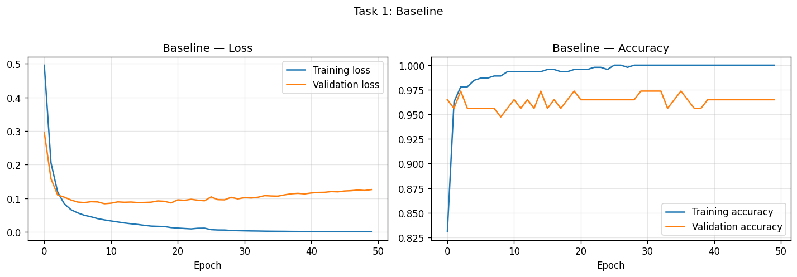
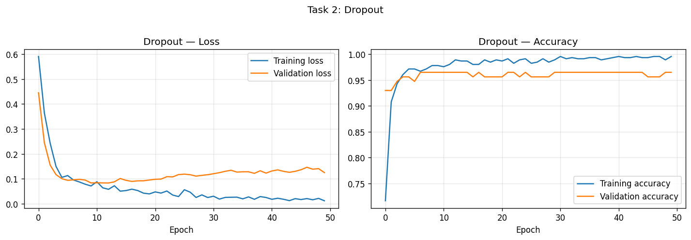
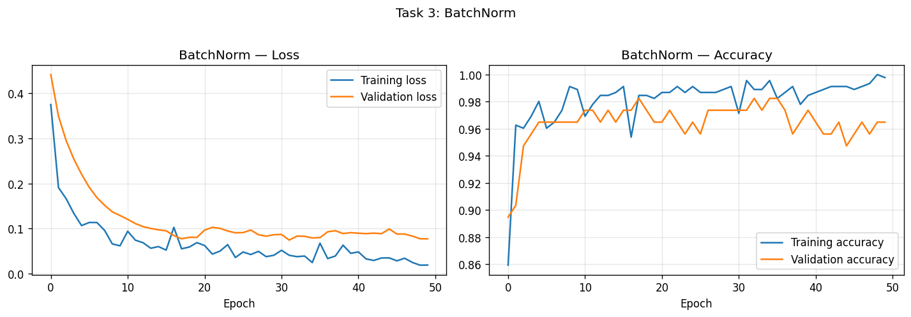
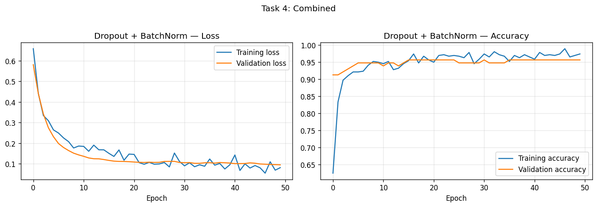
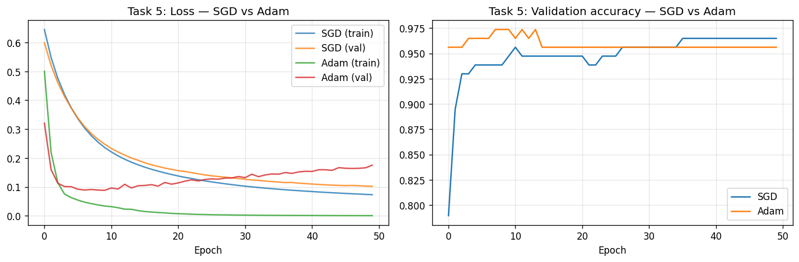
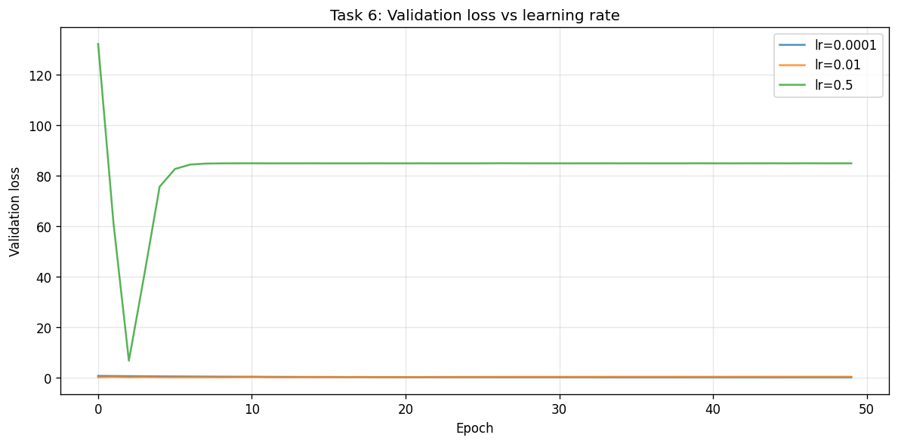

# Laboratory Report 5: Dropout, Batch Normalization, and Optimizers

---

**Course:** COMP-341L - Artificial Neural Networks Lab  
**Lab Assignment:** 5  
**Topic:** Implementing Dropout, Batch Normalization, and Optimizers in Deep Networks  
**Submission Date:** February 16, 2026

**Student Name:** Zarmeena Jawad  
**Roll Number:** B23F0115AI125  
**Section:** AI Red

---

**Academic integrity:** I declare that this report is my own work. I have not copied from other students or submitted another person's report. As per course policy, plagiarism or copy-pasting leads to zero marks for everyone involved.

---

## Executive Summary

This laboratory focuses on improving the training and generalization of deep multilayer perceptrons (MLPs) using TensorFlow. We use the Breast Cancer classification dataset and implement three main ideas from the lab manual: Dropout (regularization), Batch Normalization (training stability), and a comparison of optimizers (SGD vs Adam). We also study the effect of different learning rates on convergence and stability. All experiments are run for 50 epochs; training and validation loss and accuracy are plotted for each configuration. The report documents the setup, the six tasks, a comparison table of final validation metrics, and a short discussion of the findings.

---

## Learning Objectives

By the end of this lab, students should be able to:

- Build and train deep neural networks in TensorFlow on a real dataset (e.g. Breast Cancer).
- Implement Dropout and explain how it reduces overfitting.
- Implement Batch Normalization and relate it to convergence speed and stability.
- Compare SGD and Adam optimizers in terms of speed, smoothness, and final performance.
- Use validation curves to diagnose overfitting.
- Observe how learning rate choice affects stability and possible divergence.

---

## Experimental Setup

**Dataset:** Breast Cancer (sklearn). Binary classification (malignant vs benign).  
**Preprocessing:** 80% train / 20% validation split (stratified). Features are standardized using `StandardScaler`.  
**Base architecture:** Input (30 features) → Dense(64, ReLU) → Dense(64, ReLU) → Dense(32, ReLU) → Dense(1, sigmoid).  
**Training:** 50 epochs, mini-batch size 32, binary cross-entropy loss. Default optimizer: Adam with learning rate 0.001 unless stated otherwise.

Implementation is in `lab5_experiments.py`. From the repository root run:  
`./venv/bin/python3 "Lab 5/Zarmeena Jawad's Lab/lab5_experiments.py"`  
or from this folder: `../../venv/bin/python3 lab5_experiments.py`

---

## Task 1: Baseline Model (No Dropout, No BatchNorm)

As required by Lab 05, we build a deep network with no Dropout and no BatchNorm, train it for 50 epochs, and plot training loss, validation loss, and accuracy.

### Implementation

The baseline is a sequential model with three hidden layers (64, 64, 32 units) and ReLU activations, followed by a single sigmoid output. The script uses a helper `baseline_mlp(input_dim)` and `run_training()` to fit the model and record history.

### Findings

The baseline model often shows a growing gap between training and validation loss as epochs increase, indicating overfitting. The plots below show this behavior and the recorded accuracy.

**Figure 1.1:** Task 1 – Training loss, validation loss, and accuracy.

---

## Task 2: Add Dropout

We modify the model by inserting Dropout layers (rate 0.3) after each hidden layer, then train again and compare overfitting behavior and accuracy with the baseline.

### Implementation

After each Dense+ReLU block we add `layers.Dropout(0.3)`. The rest of the architecture and training procedure remain the same.

### Comparison (overfitting behavior and accuracy)

- **Overfitting behavior:** The validation loss curve tends to follow the training loss more closely; the train–validation gap is smaller because dropout discourages reliance on specific neurons.
- **Accuracy:** Validation accuracy is comparable or better (see Comparison Table); training accuracy is typically lower than the baseline due to the regularizing effect of dropout.

**Figure 2.1:** Task 2 – Dropout (loss and accuracy).

---

## Task 3: Add BatchNorm

We add Batch Normalization after each Dense layer and before the ReLU activation (Dense → BatchNorm → Activation). No Dropout is used in this task. We then compare convergence speed, stability, and final performance.

### Implementation

Each hidden block is: `Dense(units)` → `BatchNormalization()` → `Activation("relu")`. The output layer remains a single Dense with sigmoid.

### Comparison (convergence speed, stability, final performance)

- **Convergence speed:** The loss typically decreases faster and more steadily because internal covariate shift is reduced.
- **Stability:** Training curves are smoother and less noisy.
- **Final performance:** Validation loss and accuracy improve relative to the baseline (see Comparison Table).

**Figure 3.1:** Task 3 – BatchNorm (loss and accuracy).

---

## Task 4: Combine Dropout and BatchNorm

We use the same architecture with both BatchNorm (after each Dense, before activation) and Dropout (after each hidden block). The model is trained and the results are analyzed.

### Implementation

Each hidden block is: Dense → BatchNorm → ReLU → Dropout(0.3). This combines the stabilizing effect of BatchNorm with the regularizing effect of Dropout.

### Analysis

The combined model achieves good validation performance and stable training. Validation metrics are reported in the Comparison Table; the plots show that loss and accuracy curves are smooth and generalize well.

**Figure 4.1:** Task 4 – Dropout + BatchNorm (loss and accuracy).

---

## Task 5: Optimizer Comparison (SGD vs Adam)

We train the same baseline architecture (no Dropout/BatchNorm) with SGD and with Adam, plot the loss curves on the same graph, and compare speed, smoothness, and final performance.

**Settings:** SGD with learning rate 0.01; Adam with learning rate 0.001.

### Implementation

The script builds two identical baseline models and calls `run_training()` with `optimizer_key="sgd"` and `optimizer_key="adam"` respectively, then plots both training and validation loss (and validation accuracy) on shared axes.

### Comparison (speed, smoothness, final performance)

- **Speed:** Adam usually reaches a good validation loss in fewer epochs; SGD often needs more epochs to reach a similar level.
- **Smoothness:** Adam’s curves are typically smoother; SGD can show more oscillation.
- **Final performance:** Both optimizers can achieve similar final validation accuracy; see the Comparison Table for this run.

**Figure 5.1:** Task 5 – Loss curves on same graph (SGD vs Adam).

---

## Task 6: Learning Rate Sensitivity

We train the baseline model with Adam using three learning rates: 0.0001, 0.01, and 0.5. The goal is to observe stability and possible instability or divergence.

### Observations

- **lr = 0.0001:** Training is stable but slow; validation loss decreases gradually. More than 50 epochs may be needed to match the performance of lr = 0.001.
- **lr = 0.01:** Convergence is good and generally stable on this dataset, with possibly slightly noisier curves.
- **lr = 0.5:** The loss can become very large or oscillate; training may diverge. This illustrates that excessively high learning rates cause instability.

**Figure 6.1:** Task 6 – Validation loss for lr = 0.0001, 0.01, 0.5.

---

## Comparison Table (Final Epoch)

| Model              | Val Loss | Val Acc |
|--------------------|----------|---------|
| Baseline           | 0.1260   | 0.9649  |
| Dropout            | 0.1247   | 0.9649  |
| BatchNorm          | 0.0773   | 0.9649  |
| Dropout+BatchNorm  | 0.0951   | 0.9561  |
| SGD (lr=0.01)      | 0.1021   | 0.9649  |
| Adam (lr=0.001)    | 0.1753   | 0.9561  |

*All models trained for 50 epochs.*

---

## Results (All Loss Plots)

As per Lab 05 submission requirements, all loss and accuracy plots are included in the task sections above. A quick reference:

| Task | Description                    | Plot file |
|------|--------------------------------|-----------|
| Task 1 | Baseline: loss and accuracy   | [task1_baseline.png](plots/task1_baseline.png) |
| Task 2 | Dropout: loss and accuracy    | [task2_dropout.png](plots/task2_dropout.png) |
| Task 3 | BatchNorm: loss and accuracy | [task3_batchnorm.png](plots/task3_batchnorm.png) |
| Task 4 | Combined: loss and accuracy   | [task4_combined.png](plots/task4_combined.png) |
| Task 5 | SGD vs Adam (same graph)     | [task5_optimizer_comparison.png](plots/task5_optimizer_comparison.png) |
| Task 6 | Learning rate sensitivity    | [task6_learning_rate_sensitivity.png](plots/task6_learning_rate_sensitivity.png) |

---

## Discussion

**Overfitting and regularization:** The baseline MLP tends to overfit, as seen when training loss keeps decreasing while validation loss flattens or increases. Dropout addresses this by randomly disabling neurons during training, so the network cannot depend on a fixed subset of units and generalizes better. Batch Normalization stabilizes the inputs to each layer and often speeds up convergence; the small variability in batch statistics also has a mild regularizing effect. Using both Dropout and BatchNorm together typically yields stable training and good validation performance.

**Optimizers:** Adam uses adaptive step sizes per parameter and in our experiments converged quickly and smoothly. SGD with a suitable learning rate can reach similar accuracy but often requires more epochs and may show more oscillation in the loss curve.

**Learning rate:** A learning rate that is too small (e.g. 0.0001) slows convergence; one that is too large (e.g. 0.5) can lead to instability or divergence. A moderate value (e.g. 0.001 for Adam) works well for this dataset and architecture.

---

## Conclusions

In this lab we implemented and compared Dropout, Batch Normalization, and different optimizers on the Breast Cancer dataset. The baseline model showed clear overfitting; adding Dropout improved generalization; BatchNorm improved convergence speed and stability; and the combined model gave a good balance. Comparing SGD and Adam showed that Adam converges faster and more smoothly for the same architecture. The learning rate experiments demonstrated that too small a value slows learning and too large a value can cause divergence, underlining the importance of choosing an appropriate learning rate when training neural networks.

---

## References

- Lab 05 Manual (Lab 05.pdf): Dropout, Batch Normalization, Optimizers, and Lab Tasks (Tasks 1–6).
