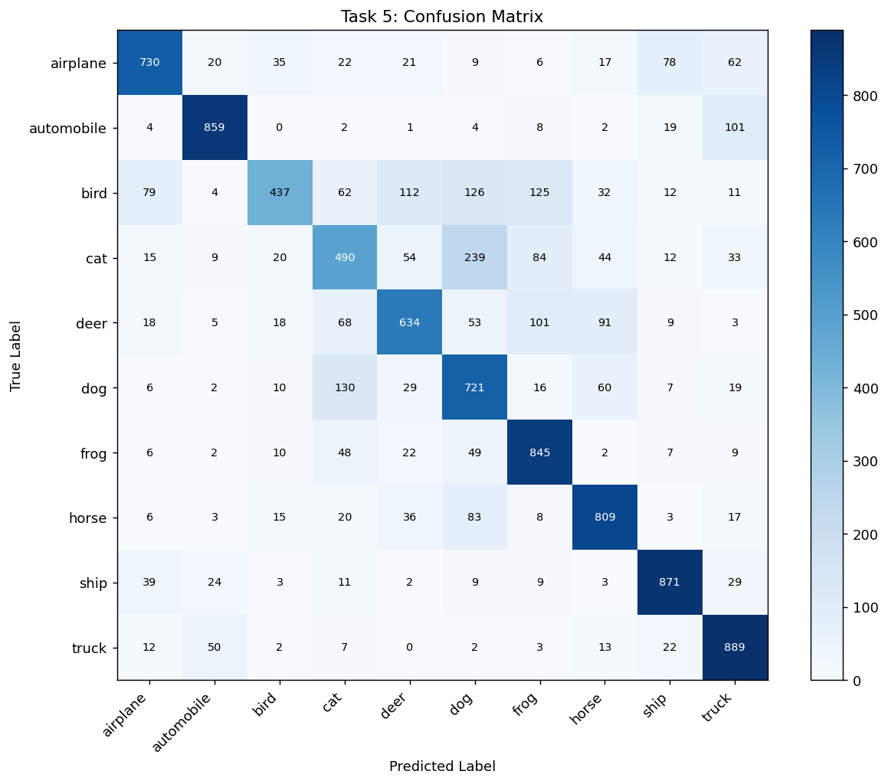
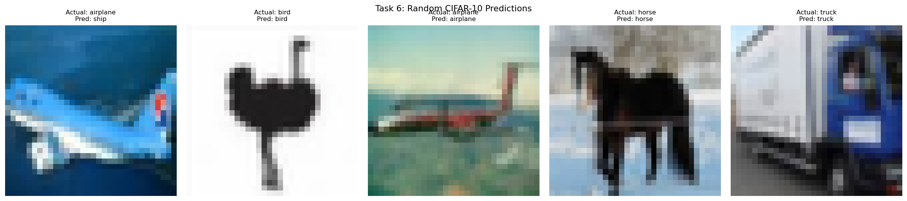
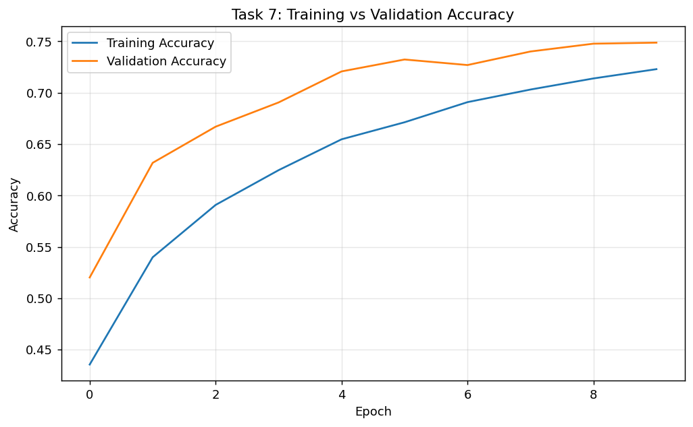
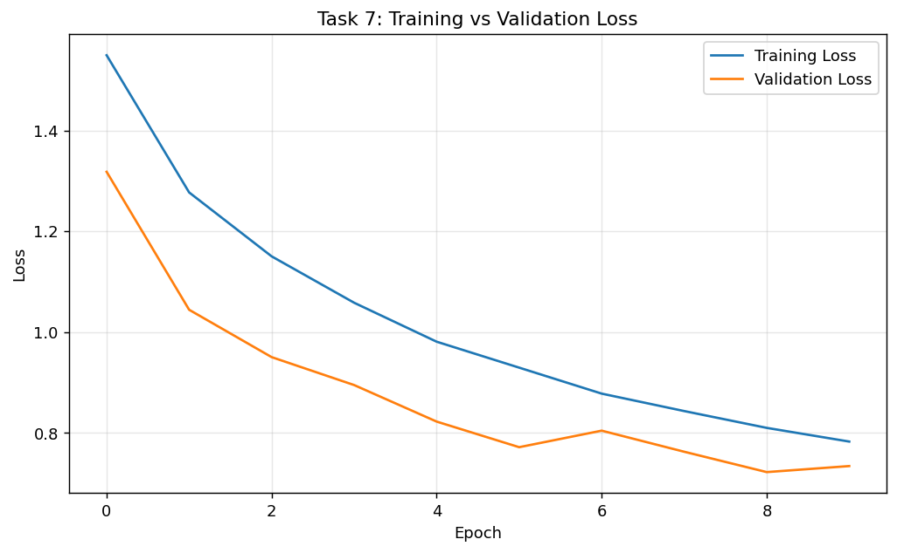

# Lab Report 6: Implementing a CNN on CIFAR-10

---

**Course Code:** COMP-341L  
**Course Name:** Artificial Neural Networks Lab  
**Lab Number:** 6  
**Lab Title:** Implementing Convolutional Neural Networks (CNN) for Image Classification  
**Date:** February 28, 2026  
**Name:** Ali Hamza  
**Roll Number:** B23F0063AI106  
**Section:** B.S AI - Red

---

## Objective

Implement and evaluate a CNN on the CIFAR-10 dataset by completing all required tasks: dataset exploration, preprocessing, CNN design, training, evaluation, prediction, visualization, and analysis.

---

## Task 1: Load and Explore the CIFAR-10 Dataset

- Displayed training and test dataset shapes: `x_train (50000, 32, 32, 3)`, `y_train (50000, 1)`, `x_test (10000, 32, 32, 3)`, `y_test (10000, 1)`.
- Visualized the 10 class names: airplane, automobile, bird, cat, deer, dog, frog, horse, ship, truck.
- Displayed 10 sample CIFAR-10 images in a 2×5 grid.

---

## Task 2: Preprocess the Data

- Normalized pixel values to the [0, 1] range by dividing by 255.
- Used sparse integer labels with `sparse_categorical_crossentropy` loss for multi-class classification.

---

## Task 3: Build a CNN Model

The model architecture includes:
- Convolution layers with ReLU activation
- Max-pooling layers for downsampling
- Dropout for regularization
- Dense layers with ReLU
- Softmax output layer for 10-class classification

---

## Task 4: Train the CNN (10 Epochs)

| Metric | Training | Validation |
|--------|----------|------------|
| **Accuracy** | 0.7230 | 0.7488 |
| **Loss** | 0.7827 | 0.7341 |

---

## Task 5: Evaluate the Model

### Test Set Performance

- **Test accuracy:** 0.7285  
- **Test loss:** 0.7774

### Confusion Matrix

*Figure 1: Confusion matrix showing predicted vs. actual labels on the CIFAR-10 test set.*

### Classification Report

| Class | Precision | Recall | F1-Score | Support |
|-------|-----------|--------|----------|---------|
| airplane | 0.7978 | 0.7300 | 0.7624 | 1000 |
| automobile | 0.8783 | 0.8590 | 0.8686 | 1000 |
| bird | 0.7945 | 0.4370 | 0.5639 | 1000 |
| cat | 0.5698 | 0.4900 | 0.5269 | 1000 |
| deer | 0.6959 | 0.6340 | 0.6635 | 1000 |
| dog | 0.5568 | 0.7210 | 0.6283 | 1000 |
| frog | 0.7012 | 0.8450 | 0.7664 | 1000 |
| horse | 0.7540 | 0.8090 | 0.7805 | 1000 |
| ship | 0.8375 | 0.8710 | 0.8539 | 1000 |
| truck | 0.7579 | 0.8890 | 0.8182 | 1000 |
| **accuracy** | | | **0.7285** | 10000 |
| **macro avg** | 0.7344 | 0.7285 | 0.7233 | 10000 |
| **weighted avg** | 0.7344 | 0.7285 | 0.7233 | 10000 |

---

## Task 6: Make Predictions

Displayed 5 random test images with actual and predicted labels for qualitative inspection.

*Figure 2: Five random test images with ground-truth and predicted labels.*

---

## Task 7: Plot Results

### Training vs. Validation Accuracy

*Figure 3: Accuracy curves over 10 epochs for training and validation sets.*

### Training vs. Validation Loss

*Figure 4: Loss curves over 10 epochs for training and validation sets.*

---

## Task 8: Analysis

The CNN achieved good performance on CIFAR-10 with a test accuracy of **0.7285** after 10 epochs. Training accuracy was 0.7230 and validation accuracy was 0.7488 (gap = −0.0258), indicating limited overfitting. CIFAR-10 contains complex natural images, so moderate accuracy is expected with short training. Performance can improve with stronger data augmentation, deeper CNN blocks, better learning-rate scheduling, and longer training.

**Per-class observations:**
- **Best-performing classes:** automobile (0.87 precision), ship (0.84), truck (0.82)
- **Challenging classes:** cat (0.53 precision), dog (0.56), bird (0.44 recall)
- Cat–dog confusion is common due to visual similarity in low-resolution 32×32 images.

---

## Conclusion

The required Lab 06 workflow was implemented successfully in Google Colab. The model was trained, evaluated, and analyzed using standard metrics and visual diagnostics. The CNN achieved ~73% test accuracy with minimal overfitting, and the confusion matrix and classification report provide clear insight into per-class performance.
