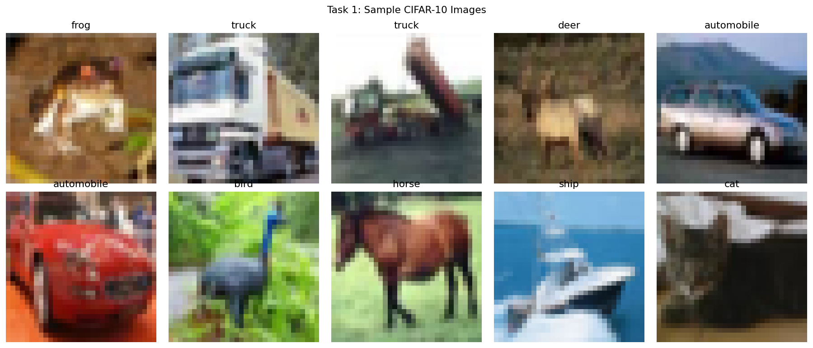
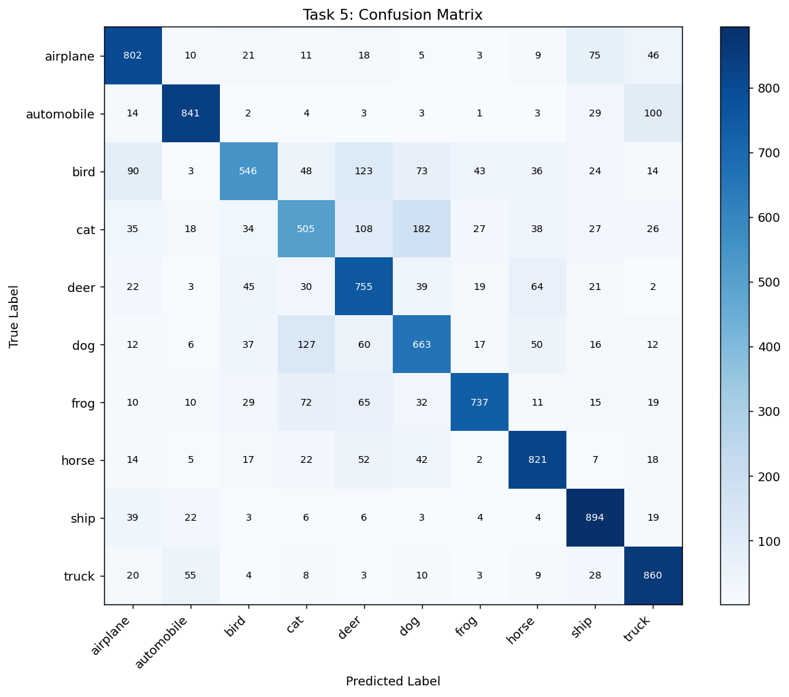
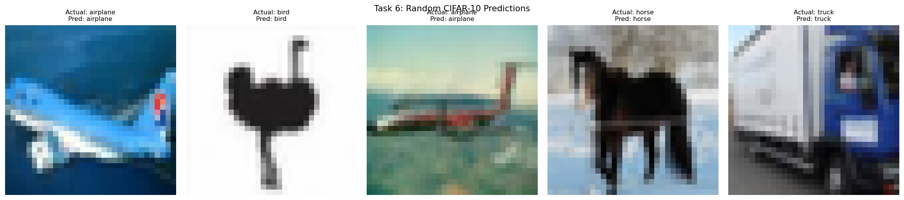
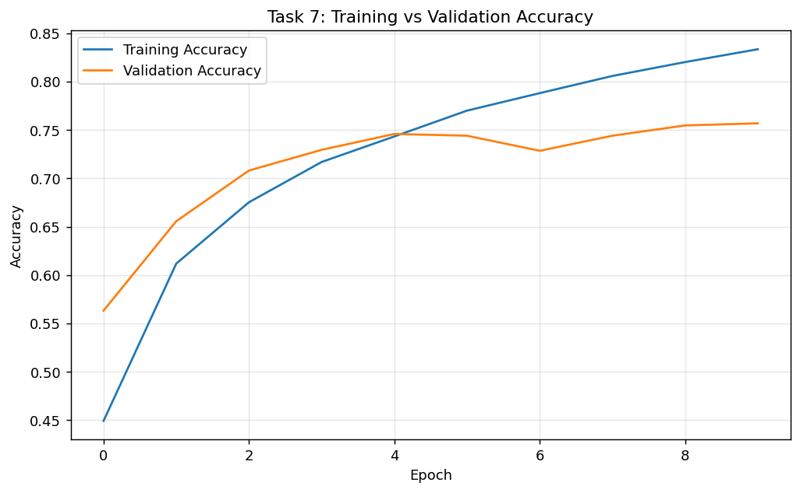
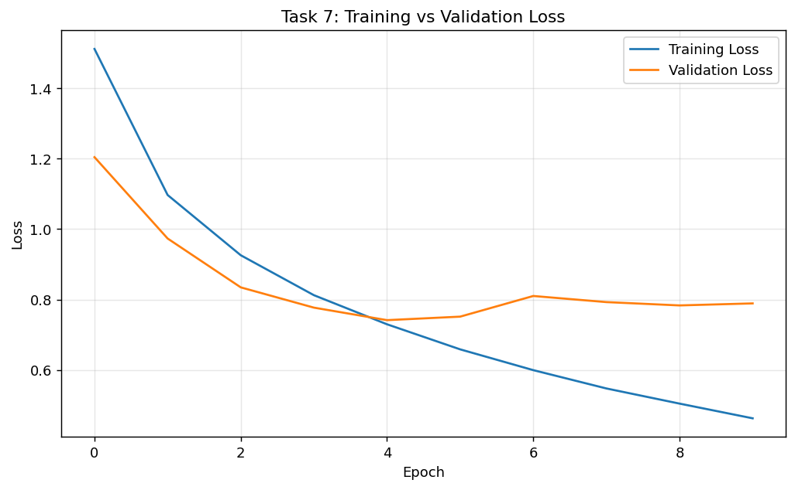

# Lab Report 6: Implementing a CNN on CIFAR-10

---

**Course Code:** COMP-341L  
**Course Name:** Artificial Neural Networks Lab  
**Lab Number:** 6  
**Lab Title:** Implementing Convolutional Neural Networks (CNN) for Image Classification  
**Date:** February 28, 2026  
**Name:** Zarmeena Jawad  
**Roll Number:** B23F0115AI125  
**Section:** AI Red

---

## Objective
Implement and evaluate a CNN on CIFAR-10 by completing all required tasks: data exploration, preprocessing,
model design, training, evaluation, predictions, plotting, and analysis.

## Task 1: Load and Explore CIFAR-10
- Dataset shapes displayed in notebook output
- Class names visualized
- 10 sample images shown



## Task 2: Preprocess Data
- Pixel values normalized to [0, 1]
- Labels kept as sparse integer classes (one-hot optional with sparse loss)

## Task 3: CNN Model
Model includes Conv layers, ReLU, MaxPooling, Dropout, Dense, and Softmax output.

## Task 4: Training (10 Epochs)
- Final training accuracy: 0.8336
- Final validation accuracy: 0.7570
- Final training loss: 0.4627
- Final validation loss: 0.7890

## Task 5: Evaluation
- Test accuracy: 0.7424
- Test loss: 0.8265



### Classification Report
```text
              precision    recall  f1-score   support

    airplane     0.7580    0.8020    0.7794      1000
  automobile     0.8643    0.8410    0.8525      1000
        bird     0.7398    0.5460    0.6283      1000
         cat     0.6062    0.5050    0.5510      1000
        deer     0.6329    0.7550    0.6886      1000
         dog     0.6302    0.6630    0.6462      1000
        frog     0.8610    0.7370    0.7942      1000
       horse     0.7856    0.8210    0.8029      1000
        ship     0.7870    0.8940    0.8371      1000
       truck     0.7706    0.8600    0.8129      1000

    accuracy                         0.7424     10000
   macro avg     0.7436    0.7424    0.7393     10000
weighted avg     0.7436    0.7424    0.7393     10000

```

## Task 6: Predictions
Five random test images with actual and predicted labels:



## Task 7: Required Plots



## Task 8: Analysis
The CNN achieved good performance on CIFAR-10 with test accuracy of 0.7424 after 10 epochs. Training accuracy was 0.8336 and validation accuracy was 0.7570 (gap=0.0766), which indicates limited overfitting. Because CIFAR-10 is a multi-class natural image dataset, accuracy can stay moderate with short training or smaller architectures. Improvements can include deeper CNN blocks, stronger data augmentation, learning-rate scheduling, tuned dropout, and training for more epochs.

## Conclusion
The required Lab 06 pipeline was implemented end-to-end on Google Colab and validated with quantitative metrics and visual diagnostics.
