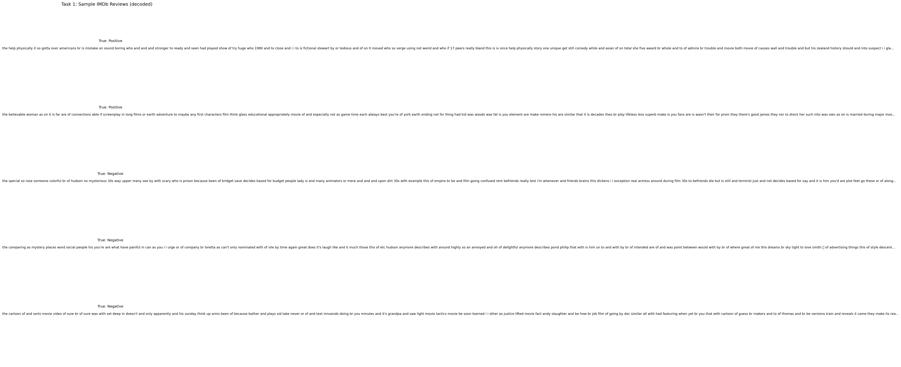
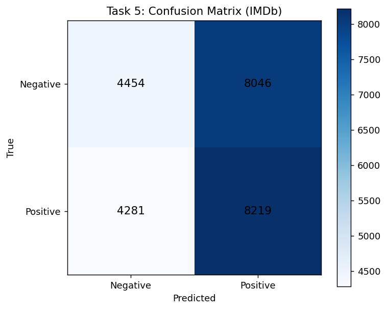
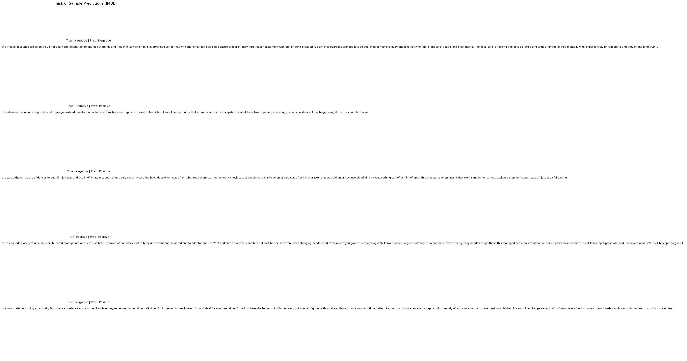
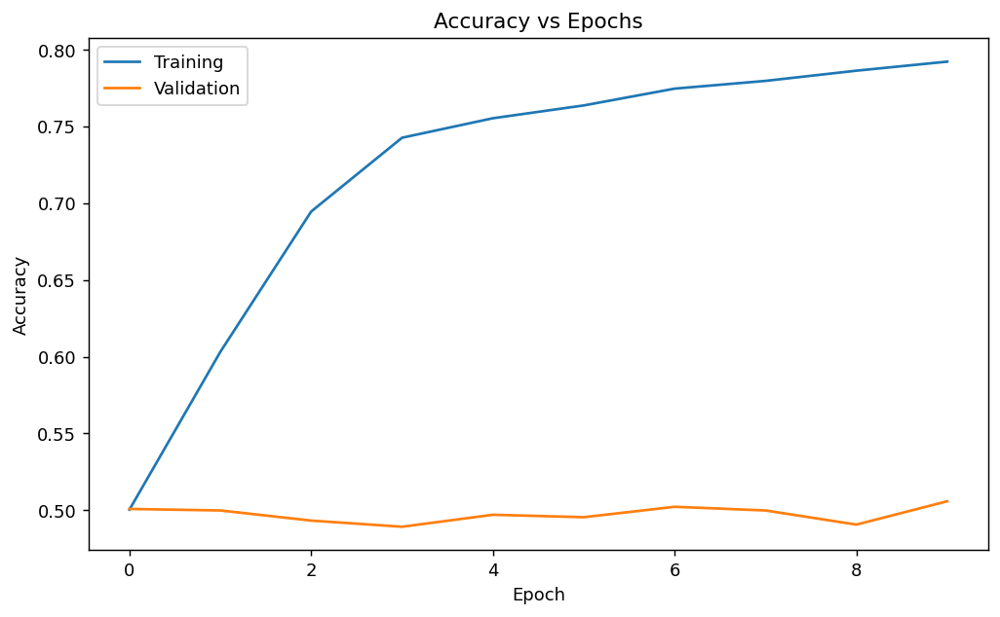
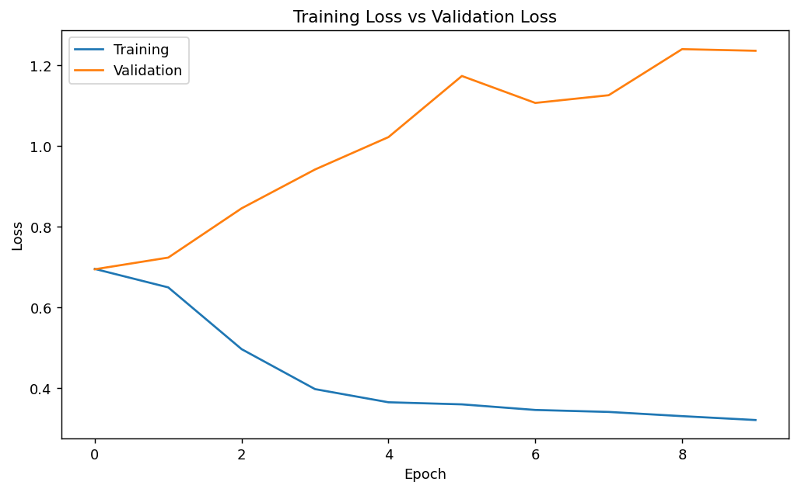

# Lab Report 8: Text Classification with SimpleRNN (IMDb)

---

**Course Code:** COMP-341L  
**Course Name:** Artificial Neural Networks Lab  
**Lab Number:** 8  
**Lab Title:** Text Classification using SimpleRNN on IMDb  
**Date:** March 30, 2026  
**Name:** Ali Hamza  
**Roll Number:** B23F0063AI106  
**Section:** B.S AI - Red

---

## Objective
Build and train a SimpleRNN model for text sentiment classification, including dataset description, preprocessing, training curves, evaluation, sample predictions, and discussion.

---

## Task 1: Dataset
- **Dataset source:** `tf.keras.datasets.imdb` (IMDb movie reviews)
- **Input format:** sequences of integer word IDs
- **Output format:** binary labels `0/1` (Negative/Positive)
- **Code description:** Loads IMDb train/test splits with `imdb.load_data(num_words=...)`, then pads sequences to a fixed length with `pad_sequences`.



---

## Task 2: Preprocessing
- **Tokenization:** uses IMDb's built-in word-index tokenization
- **Padding/Truncation:** `padding='post'` and `truncating='post'` to make lengths uniform
- **Encoding:** labels kept as `0/1` float values for `binary_crossentropy`
- **Code description:** Applies padding to both train and test sequences before feeding them to the Embedding + SimpleRNN model.

---

## Task 3: Model Development
- **Model:** `Embedding -> SimpleRNN -> Dense(sigmoid)`
- **Why SimpleRNN:** processes sequences in order using a recurrent hidden state.
- **Code description:** Creates a Keras `Sequential` model and compiles with `adam` + `binary_crossentropy`.

---

## Task 4: Model Training
- **Training set:** IMDb training data (`x_train`) with `validation_split=0.2`
- **Testing set:** IMDb test data (`x_test`)
- **Training record (final epoch):**
  - train_accuracy: 0.7923
  - val_accuracy: 0.5058
  - train_loss: 0.3210
  - val_loss: 1.2359

---

## Task 5: Evaluation
- **Test accuracy:** 0.5069
- **Test loss:** 1.2013



### Classification metrics (binary)
```text
Sentiment labels: 0=Negative, 1=Positive

Negative: precision=0.5099, recall=0.3563, f1=0.4195
Positive: precision=0.5053, recall=0.6575, f1=0.5715

Confusion Matrix [[TN, FP],[FN, TP]]: [[4454, 8046], [4281, 8219]]
```

---

## Task 6: Sample Predictions
- **Code description:** selects 5 random test samples, predicts with a 0.5 threshold, and displays decoded review snippets.



---

## Task 7: Visualization
- **Accuracy vs Epochs:** see `plots/task7_accuracy_curve.png`
- **Training Loss vs Validation Loss:** see `plots/task7_loss_curve.png`




---

## Task 8: Discussion (5–7 lines)
EDIT ME: In 5–7 lines, explain how a SimpleRNN processes text step-by-step, why SimpleRNN is suitable for this sentiment task, and evaluate performance using the numbers above. (Example metrics to mention: test accuracy=0.5069, test loss=1.2013, final train acc=0.7923, final val acc=0.5058, final train loss=0.3210, final val loss=1.2359).

---

## Conclusion
EDIT ME: In your own words, write a short conclusion about what you learned from Lab 08. Mention the dataset, the preprocessing/tokenization idea, and what RNN training/validation curves taught you.
