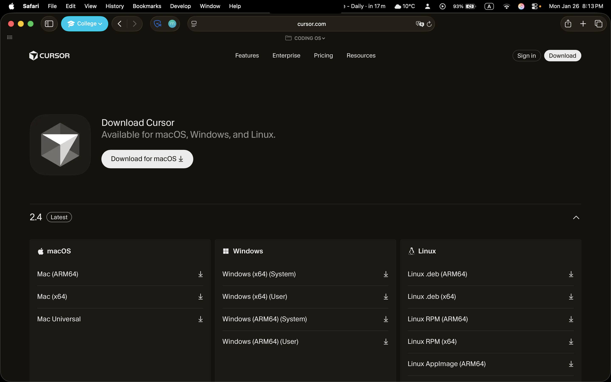
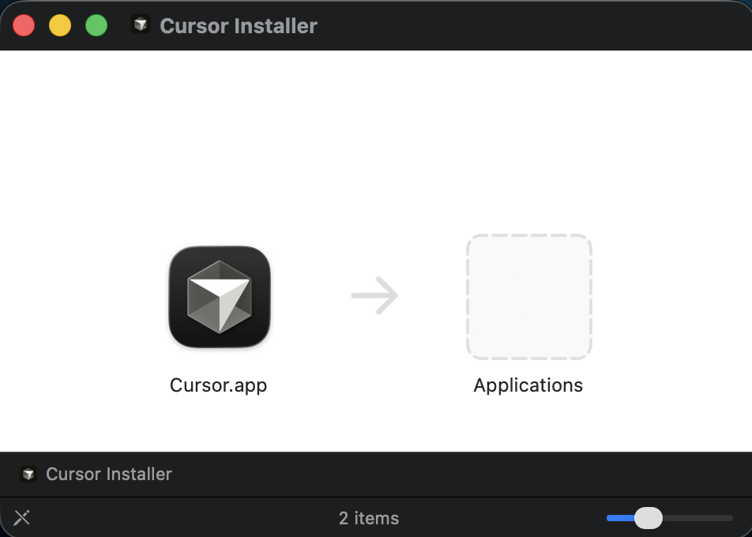
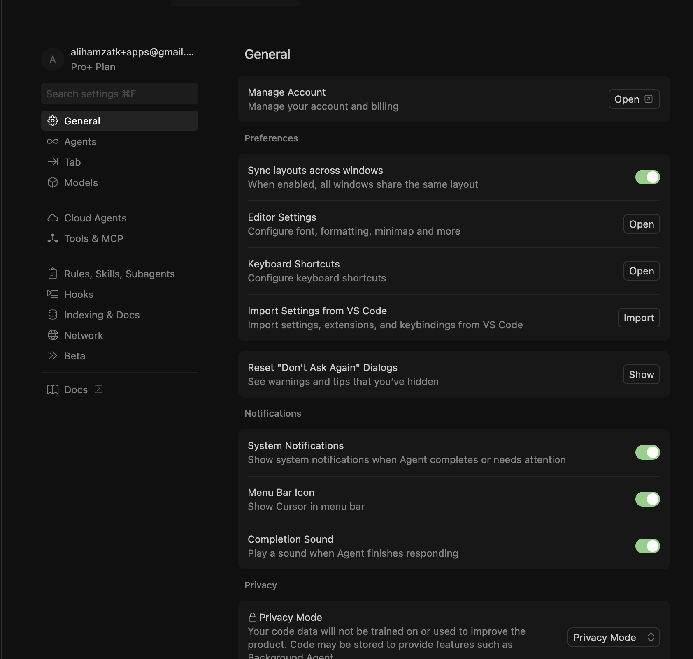

# Lab Report 1: Installation and Setup of Cursor IDE

---

**Course Code:** COMP-341L  
**Course Name:** Artificial Neural Networks Lab  
**Lab Number:** 1  
**Lab Title:** Installation and Setup of Cursor IDE  
**Date:** January 26, 2026

**Name:** Ali Hamza  
**Roll Number:** B23F0063AI106  
**Section:** B.S AI - Red

---

## Objective

To download, install, and configure Cursor IDE on the local system for use in the Artificial Neural Networks Lab course.

---

## Introduction

Cursor is an AI-powered code editor built on Visual Studio Code. This report documents the installation and setup process of Cursor IDE with step-by-step procedures and screenshots.

---

## Prerequisites

- Computer with macOS, Windows, or Linux
- Internet connection
- Administrator privileges
- Web browser

---

## Task 1: Downloading Cursor IDE

### Procedure

1. Open web browser and navigate to: `https://cursor.sh`
2. Click the "Download" button
3. Select your operating system (macOS/Windows/Linux)
4. Wait for download to complete

### Screenshot

**Figure 1.1:** Cursor website download page

---

## Task 2: Installing Cursor IDE

### Procedure for macOS

1. Open Downloads folder and locate the `.dmg` file
2. Double-click to mount the disk image
3. Drag Cursor icon to Applications folder
4. Eject the disk image after copying completes

### Procedure for Windows

1. Open Downloads folder and locate the `.exe` file
2. Double-click the installer
3. Follow the installation wizard (accept license, choose location, click Install)
4. Click Finish when installation completes

### Screenshot

**Figure 2.1:** Installation process

---

## Task 3: First Launch and Initial Setup

### Procedure

1. Launch Cursor from Applications (macOS) or Start Menu (Windows)
2. Accept terms of service if prompted
3. Choose preferred theme (Dark/Light)
4. Optionally sign in with email/GitHub/Google account
5. Cursor opens to main interface

### Screenshot

**Figure 3.1:** Main Cursor interface

---

## Task 4: Configuring Cursor Settings

### Procedure

1. Open Settings: Press `Cmd + ,` (macOS) or `Ctrl + ,` (Windows/Linux)
2. Configure editor settings:
   - Font size: 12-14
   - Tab size: 4 spaces
   - Enable line numbers and word wrap
3. Install extensions:
   - Click Extensions icon (or `Cmd+Shift+X` / `Ctrl+Shift+X`)
   - Install Python extension (by Microsoft)
   - Install Jupyter extension (by Microsoft)
4. Settings are saved automatically

### Screenshot

**Figure 4.1:** Settings and extensions configuration

---

## Task 5: Verifying Installation

### Procedure

1. Check version: Cursor → About Cursor (macOS) or Help → About (Windows)
2. Test file operations: Create and save a new file
3. Test AI features: Press `Cmd+L` (macOS) or `Ctrl+L` (Windows) to open AI chat
4. Test code editing: Create a Python file and verify syntax highlighting
5. Test terminal: Open integrated terminal (`` Ctrl+` ``)

---

## Results and Observations

### Installation Summary

- Cursor IDE downloaded successfully
- Installation completed without errors
- Application launches correctly
- Settings configured
- Extensions installed
- All features working properly

### Version Information

- **Cursor Version**: 2.4.21
- **Installation Date**: January 26, 2026
- **Operating System**: macOS 26.2

---

## Conclusion

This lab provided me with hands-on experience in installing and configuring a modern development environment. Through the process of downloading and installing Cursor IDE, I learned the importance of following systematic installation procedures and understanding the differences between installation methods on different operating systems.

The installation process was straightforward, and I was able to successfully set up Cursor IDE on my macOS system. I found the drag-and-drop installation method on macOS to be intuitive, and the application launched without any issues. During the configuration phase, I learned how to customize the editor settings to match my preferences, which will help improve my coding productivity.

Installing the Python and Jupyter extensions was particularly important for this course, as we will be working with neural networks and machine learning projects. The extension marketplace made it easy to find and install the necessary tools. I also appreciated how Cursor's AI features are integrated directly into the editor, making it accessible through a simple keyboard shortcut.

The verification process helped me understand the importance of testing software installations to ensure all components are working correctly. I was able to confirm that file operations, code editing, syntax highlighting, and the integrated terminal all functioned as expected.

Overall, this lab taught me valuable skills in setting up development tools, which is essential for any programming work. The experience of configuring an IDE from scratch gave me confidence in managing my development environment, and I now feel prepared to use Cursor IDE effectively for the upcoming labs in this course.

---

## References

1. Cursor Official Website: https://cursor.sh
2. Cursor Documentation: https://docs.cursor.sh

---

## Appendix: Screenshots

1. **01_cursor_website_download.png** - Cursor website download page
2. **02_installation_process.png** - Installation process
3. **03_cursor_main_interface.png** - Main Cursor interface
4. **04_settings_extensions.png** - Settings and extensions

---

**Prepared by:** Ali Hamza  
**Roll Number:** B23F0063AI106  
**Section:** B.S AI - Red  
**Date:** January 26, 2026
